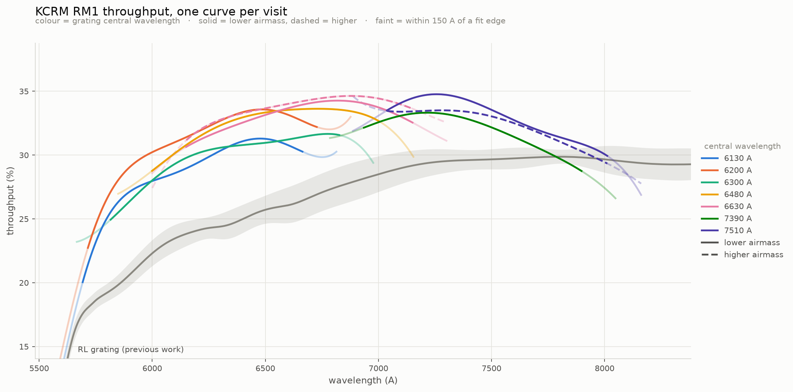

# RM1: what differed from the RL, RH1, RH2, RH3 and RH4 runs

Only the deltas. The pipeline itself is [PYPEIT.md](PYPEIT.md) and
[THROUGHPUT_PROCEDURE.md](THROUGHPUT_PROCEDURE.md); the missing-template argument
is [RH1_WAVELENGTH.md](RH1_WAVELENGTH.md) and is not repeated here.

Written 2026-08-26, PypeIt 2.0.1, spectrograph `keck_kcrm`.

**STATUS: COMPLETE.** All 9 configurations reduced (33/33 frames), 9 cubes, 9
sensfuncs at polynomial order 5. Peak throughput 34.8% at 7257 A (Large slicer).
A ~6-8% Small/Medium-slicer throughput penalty is established project-wide in
section 8.3 and applies to every grating, not just RM1.

Scope: **6 nights, 9 science configurations, 33 standard-star frames**, every one
of them feige34.

RM1 is the grating where **PypeIt ships a template that works, at one of the
seven central wavelengths in this run and not at the other six** — and where
nothing whatsoever says so. Sections 2 and 3 are the ones worth reading.

---

## 1. Nine configurations, seven central wavelengths, two slicers

| config | cenwave | slicer | binning | frames | exposures |
|---|---|---|---|---|---|
| 2024-04-01 A | 6130 | Small | 1x1 | 2 | 25, 100 s |
| 2024-05-02 B | 6200 | Large | 2x2 | 6 | 5, 15, 45, 60, 120, 120 s |
| 2024-03-15 B | 6300 | Large | 2x2 | 7 | 6, 15, 45 x5 |
| 2023-12-09 B | 6480 | Large | 2x2 | 2 | 7, 14 s |
| 2023-12-10 C | 6630 | Large | 2x2 | 4 | 15 s each |
| 2023-12-11 C | 6630 | Large | 2x2 | 4 | 15 s each |
| 2024-04-01 B | 7390 | Small | 1x1 | 2 | 200 s each |
| 2023-12-10 B | 7510 | Large | 2x2 | 3 | 15 s each |
| 2023-12-11 B | 7510 | Large | 2x2 | 3 | 15 s each |

`pypeit_setup -c all` also produces a **setup A on every night that is not in
this table** — the night's stray FPCam test biases, darks and biases, at
`cenwave 0.0` or 15757 A. That is the normal KCRM pattern (RH3.md: "setup A is
always that night's stray DARK plus biases") and those are skipped without
gating. **2024-04-01 is the exception and it is a real configuration**: Small
slicer, 1x1, cenwave 6130, two feige34 exposures with their own arcs, contbars,
domeflats, flatlamps and biases. PypeIt lettered it A because it orders
configurations its own way, which is PYPEIT.md's own gotcha — the letter is not
stable. Filter on the science-frame count, never on the letter:

```
2023-12-09 A  cenwave 0.0        Medium  2,2   science=0     skip
2023-12-10 A  cenwave 0.0        Large   2,2   science=0     skip
2023-12-11 A  cenwave 0.0        Large   2,2   science=0     skip
2024-03-15 A  cenwave 7799.97    FPCam   2,2   science=0     skip
2024-05-02 A  cenwave 15757.51   Medium  2,2   science=0     skip
2024-04-01 A  cenwave 6129.97    Small   1,1   science=2     KEEP - the 6130 config
```

Three structural facts follow from that table, and each one breaks an assumption
an earlier run was allowed to make.

**A night is not a configuration.** 2023-12-10 and 2023-12-11 each carry TWO
science setups — B at 7510 and C at 6630. Every earlier run in this project had
at most one usable configuration per night, so `night` and `config` were
interchangeable in tags, filenames and tables. Here they are not, and a tag keyed
on the date alone silently collides two different grating angles.

**Seven central wavelengths is 1380 A of grating rotation.** RL had four, RH2
three, RH3 two. RH2 established that a KCRM grating's throughput peak tracks the
grating angle; with seven angles, "the throughput of RM1 at 6600 A" is not one
number until it is said which angle produced it.

**Two slicers, and they differ in binning too** — Large/2x2 on five nights,
Small/1x1 on 2024-04-01. That drives the extraction aperture (section 6) and
forbids a shared wavelength template (section 4).

---

## 2. A shipped template that works at one setting in seven

`keck_kcwi.py::config_specific_par` maps dispname RM1 to `keck_kcrm_RM1.fits`,
and RM1 is one of the four setups `keck_kcwi.py:1231` lists as supported. The
template is real and, where it reaches, excellent. It simply does not reach:

```
shipped keck_kcrm_RM1.fits    6293.1 - 7733.7 A   (2064 px, binspec 2, 0.7006 A/px)
                                                  centre 7013 A
an RM1 exposure                 1446 A wide       (2064 binned px x 0.7006)
```

so how much of a detector has template under it is set entirely by where the
grating was pointed:

```
cenwave 7390   74%        cenwave 6480   63%
cenwave 6630   73%        cenwave 6300   50%
cenwave 7510   65%        cenwave 6200   44%
                          cenwave 6130   39%
```

Gated on all nine configurations, **one passes**:

```
config          cenw  slicer  overlap   slices within 2% of median disp   disp
2023-12-10 C    6630  Large     73%            24 / 24                  0.7071   CLEAN
2023-12-11 C    6630  Large     73%            24 / 24                  0.7070   CLEAN
2023-12-11 B    7510  Large     65%            23 / 24                  0.6887
2023-12-10 B    7510  Large     65%            20 / 24                  0.6886
2023-12-09 B    6480  Large     63%            16 / 24                  0.7099
2024-05-02 B    6200  Large     44%            11 / 24                  0.7168
2024-04-01 B    7390  Small     74%            15 / 25                  0.3451
2024-04-01 A    6130  Small     39%             3 / 24                  0.3799
2024-03-15 B    6300  Large     50%             4 / 24                  0.6714
```

RH3 measured its shipped template failing at ~50% coverage and inferred a
threshold there. **RM1 says the threshold is higher than that: 65% is not
enough, and 74% is not enough either.** Coverage is necessary and not
sufficient — 7390 sits at the best coverage in the run and still breaks, because
it is also the Small slicer, at a spectral resolution the template was not built
at.

---

## 3. "Solved" is the wrong column. Dispersion agreement is the right one.

This is the transferable part of the run.

The 24 slices of one setup are **the same grating at the same angle**. Their
wavelength windows differ by design — each slice mirror feeds the grating at a
slightly different angle — but their *dispersion* cannot: it is one grating, one
setting. So the 24 dispersions must agree to a fraction of a percent, and
`check_rm1_gates.py` reports how many do.

Measured, on the setups above: the good slices agree to **0.3%**, and the broken
slices carry dispersions of **0.40 to 1.17 A/px against the ~0.71 their siblings
share** — off by up to 65%.

Every weaker check passes on those same broken setups:

- `run_pypeit -c` **returned 0** on all nine.
- **No `Not enough useful IDs`** was logged on any of them. `full_template`
  cross-correlated all 24 slices and reported a shift and a coefficient for each.
- PypeIt **flagged nothing**: `health()` finds 0 slices masked on every config.
- **RMS looks fine.** 2024-05-02 B has a median RMS of 0.218 px — better than the
  clean 6630 config's 0.200 px is far from — while 13 of its 24 slices are wrong.
  A wrong solution fitted through few lines has a small residual, which is the
  "few points, small residual" trap RH1_PROCEDURE.md names.

The cross-correlation diagnostics do show it, if read as a *set* rather than one
line at a time:

```
config          shift range over 24 slices    cc median
2023-12-10 C    191 px, smooth odd/even comb    0.30     <- the clean one
2023-12-09 B    434 px                          0.25
2023-12-11 B    904 px                          0.22
2023-12-10 B    974 px                          0.23
2024-05-02 B   1197 px, two clusters            0.27
2024-03-15 B   1372 px, three clusters          0.26
```

Adjacent KCRM slices differ by a few pixels. A shift jumping a thousand pixels
between neighbours, landing in two or three clusters, is the cross-correlation
returning its own noise.

### 3.1 RH1's accidental safety net does not exist here

On RH1, unsolved slices crashed the flat field, which is how that run learned it
had a problem. **RM1 never gets that warning.** Every broken configuration wrote
all ten calibration products — `Alignment Arc Bias Edges Flat ScatteredLight
Slits Tiltimg Tilts WaveCalib` — with zero tracebacks. The flat field survives
because the slices are not *unsolved*; they are *wrongly solved*, which is worse
and quieter. Nothing between here and a throughput curve would have stopped.

---

## 4. Four templates, all bootstrapped out of the failures

RH3 section 4's play, used four times. A configuration the shipped template fails
to calibrate still produces slices that pass the strict seed criteria, and those
seed a template that then calibrates it.

```
template                       range (A)        seeded from                     serves
keck_kcrm_RM1_6300.fits        5480.2-7107.8    2024-05-02 B + 2024-03-15 B     6130?, 6200, 6300, 6480
keck_kcrm_RM1_7510.fits        6751.4-8279.5    2023-12-11 B only               7510 (both nights)
keck_kcrm_RM1_7390_small.fits  6629.8-8130.7    2024-04-01 B                    7390
(PypeIt's keck_kcrm_RM1.fits)  6293.1-7733.7    --                              6630 (both nights)
```

**One template serves four central wavelengths.** RH3 built one per cenwave
because it had two; seven would be busywork. An RM1 exposure is 1446 A wide, so
`keck_kcrm_RM1_6300.fits` sits under 95% / 99% / 100% / 93% of the 6130 / 6200 /
6300 / 6480 detectors respectively — against the 39-63% at which the shipped one
fails there. The cost is width: at 1628 A the template is 112% of one exposure,
where RH4's "one exposure wide is the good case" argues for less. 112% is
accepted; RH1's four lost slices came from a template far wider than that.

**7510 is seeded from one night on purpose.** Both 7510 nights yield seeds, and
using both would make a wider template — but then gating either one reproduces
the arc it came from, which is the weakness RH3 section 9 had to admit to. Seeded
from 2023-12-11 B alone, **2023-12-10 B is an independent test of whether the
template generalises.**

Every template carries `SEEDNITE` / `SEEDSPAT` / `NSEED` / `CENWAVE` / `DECKER`
headers, and `gate_rm1_template.py` reads provenance from the file rather than
inferring it — RH3 section 9's fix, inherited.

### 4.1 The evidence a solution is real, not merely self-consistent

The same physical slit, solved independently on two nights a day apart, at
cenwave 6630 on PypeIt's own template — 17 slits common to both:

```
   spat   blue 2023-12-10   blue 2023-12-11   difference
    143         5975.2 A         5975.3 A       -0.13 A
    219         5882.7           5882.9         -0.19
    297         5958.4           5958.4         -0.02
    371         5874.9           5875.0         -0.10
   1998         5991.9           5992.1         -0.17

   |d blue|  max 0.20 A, median 0.08 A
   |d disp|  max 0.00017 A/px = 0.025%
```

At 0.707 A/px a single misidentified line moves a solution by ~0.7 A. Agreement
at 0.08-0.20 A rules that out. The same test on the 7510 pair, before any
template of ours existed: both nights independently returned seed ranges of
6751-8280 A and dispersions of 0.6887 and 0.6886 A/px.

---

## 5. Two parameters had to move, and both are properties of the grating

### 5.1 `--span`: an RM1 slice is 1453 A, not 400-900

`pick_seed_slits` rejects a slice whose wavelength span falls outside 400-900 A,
a window set from RH1 (~630 A) and RH2 (~764 A). RM1 slices span **~1453 A**.
Called with the default, every slice of a perfect setup is rejected as nonsense
and the tooling reports 0 usable — a unit mismatch wearing the costume of bad
data. RH3's notes already warn about this after RH4 lost ten minutes to it; on
RM1 it would have been worse than slow, because the reduction still runs.

Every RM1 entry point defaults to 1200-1700 and passes it through.

### 5.2 `shift_tol`: RM1's slice-to-slice spread is the largest measured here

`health()` calls a slice SHIFTED when its blue end sits >50 A from the median, a
threshold measured on RH2 (31.8-38.4 A) and RH4 (34.0 A) and given a parameter by
RH3 (44.6 A, 5 A of headroom). RM1 blows straight through it. On 2023-12-10 C —
24/24, RMS 0.200 px, 75 lines fitted per slit, dispersions agreeing to 0.3%, by
every other measure the cleanest configuration in the run:

```
blue ends       5852.5 - 5991.9 A       union 139.4 A
median          5907.6 A                max |blue - median|  84.3 A
beyond the 50 A default                       5 slices
beyond 100 A                                  0 slices
```

The spread is not misidentification. It alternates cleanly odd slice / even
slice — means 5874.4 and 5949.0 A, a **74.6 A comb** — which is slicer geometry.

**And the slicer moves it again.** RH3 made `shift_tol` a parameter on the
finding that it is a property of the grating. RM1 shows it is a property of the
grating *and the slicer*:

```
6630 Large 2x2   blue-end union 139 A   max |blue - median|   84.3 A
7510 Large 2x2                  129 A                         78.6 A
6130 Small 1x1                  170 A                        105.8 A
```

At a single grating-wide 100 A, the 6130 Small gate reported **FAIL 23/24** on a
configuration that is correct: the offending slice, spat 3975, fits **97 lines**
— the most of any slice in that setup — at rms 0.118 against a median of 0.119,
with a dispersion of 0.3575 against the median 0.3582, i.e. **−0.19%**. The
7510 setup's most deviant slice reads exactly the same −0.19%. Both are geometry.
The deviations also form a smooth ladder (105.8, 78.7, 64.4, 61.1, 61.1 A), not
one outlier against a tight cluster, which is what a misidentification looks
like.

So the tolerance is chosen per slicer — **Large 100 A, Small 120 A** — and the
gate, the driver and `check_rm1_gates.py` all read it from one function so they
cannot disagree. A misidentification at this dispersion moves a solution by
200-340 A, which 120 A still catches comfortably.

**The general lesson, third time asked:** the number that separates "geometry" from
"error" is a property of the *configuration*, not of the code. RH2 set it from
Large-slicer high-dispersion data, RH3 found the grating moves it, RM1 finds the
slicer moves it too. Read it off setups already known good before trusting it to
judge one that is not.

---

## 6. Units, twice over, because RM1 mixes slicers

RH1_PROCEDURE.md's fifth problem was an extraction aperture defined in spaxels.
A spaxel is **1.358" on Large/2x2 and 0.339" on Small/1x1** — a factor of four —
so `pypeit_extract_datacube`'s default 4-sigma-in-spaxels aperture measures a
different solid angle per configuration. RM1 uses both, in the same run, so
`--boxcar 3.4` (arcsec) is not a refinement here but a requirement. 3.4" is the
radius RH1 validated across these same two configurations.

The same trap has a second exit on RM1: `check_cube` measures flux concentration
inside a radius derived from *that cube's own* CDELT, because 3.4" is 2.5 spaxels
on Large/2x2 and 10.0 on Small/1x1. Any fixed spaxel count would measure the star
on one night and the field edge on the other.

### 6.1 The exposure-time floor is 3 s, not RH3's 10 s

RH3's floor exists to drop acquisition and focus frames — its 1 s g191b2b frame.
RM1's shortest science frames are 5, 6 and 7 s, and they are real exposures of a
bright standard (feige34, V = 11.2) at medium dispersion. Importing RH3's 10 s
floor would drop the 7 s frame of 2023-12-09 B, leaving that configuration with
**one** frame — and a single-frame cube is the unsolved failure
THROUGHPUT_PROCEDURE.md documents, where `combine = False` writes a broken WCS and
inflates the counts by ~1e21. A threshold imported from another grating would
have silently destroyed a whole central wavelength.

### 6.2 A twenty-fifth slice: RH1's column 653 is permanent

2024-04-01 B reports **25 slits**, not 24, and `run_pypeit` dies with
`Alignment tracing has failed on slit 4/25`.

RH1_PROCEDURE.md problem 4 found detector column 653 going dead above spectral
row ~3480 on 2023-11-08, and closed by asking whether it was a permanent defect.
**It is.** Measured here on a different night, a different slicer and a different
binning — median counts down each column, top eighth of the detector:

```
col 651   17788        col 653     290   <- dead
col 652   17787        col 654   17550
                       col 655   17722
```

What is new is that **the same dead column breaks one setup of a night and not
the other**, and the reason is geometry. A dead column only invents a slice when
it falls INSIDE a lit slice; where it falls in the gap between slices it costs
nothing, because a gap is dark there anyway.

```
setup A (6130)   at rows 3600+ the slice boundary already sits at ~654, so
                 column 653 lies ON the edge and is absorbed   -> 24 clean slices
setup B (7390)   at the same rows the slice is still lit out to ~662, so column
                 653 sits ~9 columns INSIDE it.  17,800 -> 290 is a far sharper
                 gradient than any real slit edge, so the tracer registers an
                 edge, cuts an 8.9 px sliver, and truncates the real slice from
                 140.3 to 126.3 px                             -> 25 slices, dead run
```

The grating setting moves the slice boundaries a few columns across the detector,
so which case you get is decided by the **central wavelength**, not by the
detector. It cannot be predicted from the detector alone, and a config that has
always been fine can start failing when the grating is re-pointed.

Fix — the same mechanism as RH1's, a slightly wider window:

```ini
[calibrations]
    [[slitedges]]
        exclude_regions = 1:642:656,
```

The trailing comma is required — the parameter is a list, and without it PypeIt
iterates the string character by character.

Result: **24 slits, widths 139.9-140.7 px** (median 140.3), rms 0.106 px, rc=0,
all ten calibration products, and the real boundary recovered at 671.6 with its
full width. Compare the 8.9 px sliver and 126.3 px truncated neighbour before.

RH1 used `1:652:655,` and warned that the window must stop short of the real
edge, "which still has to be found". **That warning does not transfer cleanly
here**, and it is worth saying why. RH1's real edge sat at ~658, outside its
window. RM1's slice boundary on this setup *leans*, running ~655 at row 371 and
~663 by row 2435, so it passes THROUGH 642-656 in the bottom third of the
detector — precisely where column 653 is still healthy and generating no
spurious edge at all. The window therefore does clip a real edge over part of
its length.

It works anyway, because PypeIt traces an edge from the rows where it is visible
and carries the trace through the excluded rows. That was not obvious in advance
and was settled by running it, not by argument. A narrower window would also be
defensible; this one is measured to work.

Both `gate_rm1_template.py` and `run_rm1.py` rebuild the parameter header, so
both were taught to read `exclude_regions` back out and re-emit it. An earlier
version dropped it silently, which put the 25th slice straight back.

Figure: `rm1_7390_slice_defect.png`
(`pypeit_test/plot_rm1_slice_defect.py`).

**Two ways this was nearly missed**, both worth naming:

1. **Wrong coordinate frame.** `keck_kcrm` has `spatflip = True`, so raw spatial
   column c is oriented column 4113-c, and the raw frame carries overscan that is
   trimmed. Hunting for column 653 in raw coordinates finds a perfectly healthy
   pixel, because raw 653 is not oriented 653. Slit traces live in the oriented
   frame; anything compared against them must be put there first.
2. **A sampling stride that stepped over it.** Printing the oriented flat every
   3rd column from 636 gives 636, 639, ... 651, **654** — it skips 653 exactly.
   The column read healthy twice before a per-column scan found it.

---

## 7. A gate that judged the wavelength solution and not the calibration

Found in this project's own code, by the run it was written for.

`gate_rm1_template.py` reported **PASS 24/24** on three configurations whose
**flat field had never been written**.

The trigger was not a defect in anything: `QA/` was deleted by hand during a
disk cleanup while those three configs were mid-run, so `run_pypeit` failed
writing a QA png part-way through building the flat and exited 1. That is
correct behaviour -- the file was gone. Nothing needed re-downloading either;
`Calibrations/` and `QA/` are derived products, and the raw flat frames (15, 18
and 9 of them) were all still on disk.

What *was* defective is that the gate did not notice. Any cause -- a full disk,
a killed process, a genuine PypeIt error -- would have produced the same false
PASS, and the shape of it is the one section 3 is about:

```
run_pypeit -c returned 1
slices solved, unflagged and unshifted: 24 / 24
   rms median 0.265 px, worst 0.452 px
PASS: 24/24 usable slices (needed 24)          <- and no Flat_*.fits on disk
```

The gate read `WaveCalib_*.fits`, found a good wavelength solution, and never
looked at the exit code or at whether the other nine products existed. **A
wavelength solution is not a calibration.** The gate now fails on a non-zero
`run_pypeit` exit code and on any of `Arc Edges Slits Flat Tilts WaveCalib`
missing, and prints which.

Worth stating plainly: the check that catches a tool lying to you has to be
written as carefully as the tool. This one was not, first time -- it trusted a
product it did not look for, which is the same mistake as trusting a wavelength
solution nobody checked the dispersion of.

---

## 8. Results



Nine visits, seven central wavelengths, all 33 science frames reduced. Peak
throughput **34.8% at 7257 A**, measured on the photometric subset (see 8.3).

| config | cenw | airmass | fit range (A) | peak | peak at | mean |
|---|---|---|---|---|---|---|
| 2024-04-01 A | 6130 | 1.35 | 5542-6814 | 31.3% | 6477 | 28.6% * |
| 2024-05-02 B | 6200 | 1.10 | 5565-6878 | 33.6% | 6484 | 31.1% |
| 2024-03-15 B | 6300 | 1.34 | 5666-6977 | 31.7% | 6776 | 29.8% * |
| 2023-12-09 B | 6480 | 1.09 | 5849-7155 | 33.6% | 6731 | 32.5% |
| 2023-12-10 C | 6630 | 1.09 | 6000-7301 | 34.3% | 6820 | 33.1% |
| 2023-12-11 C | 6630 | 1.09 | 6000-7301 | 34.6% | 6878 | 33.7% |
| 2024-04-01 B | 7390 | 1.31 | 6786-8048 | 33.3% | 7217 | 31.9% * |
| 2023-12-10 B | 7510 | 1.09 | 6887-8162 | 34.8% | 7257 | 33.0% |
| 2023-12-11 B | 7510 | 1.09 | 6888-8162 | 33.5% | 7283 | 32.3% |

> **The results below predate the 10 s exposure floor.** `run_rm1.py` and
> `run_rm1_throughput.py` now drop science frames under 10 s, yielding only when
> that would leave a configuration with fewer than two frames. Every number in
> section 8 was produced *before* that change, from the full frame lists. Applying
> the floor would rebuild two cubes -- 2024-03-15 B (6300) loses its 6 s frame,
> 6 remain; 2024-05-02 B (6200) loses its 5 s frame, 5 remain -- and 2023-12-09 B
> (6480) is unchanged because the floor yields there. The other six configs are
> already all >= 15 s and cannot move. Expect small shifts on 6300 and 6200 if
> these are ever re-run; nothing else.

`*` = the three configs discussed in 8.3: 6130 and 7390 carry the ~7% Small-slicer
term, 6300 is a Large config that is low for unresolved reasons. Peaks are taken 150 A
inside each fit edge, the same interior the figure draws solid; taken to the
raw edge, 2023-12-11 B reports a spurious "peak" at its own blue limit.

### 8.1 The polynomial order is 5, and interior scatter cannot tell you that

RM1's fit range is ~1300 A. RL used order 15 over ~3400 A (227 A per degree of
freedom) and it worked; RH3 used 15 over ~750 A (47 A/DOF) and it invented shape
that independent nights did not share. Order 7 here is 186 A/DOF, near the RL
ratio, so it was the plausible default -- and it was wrong.

`order_study_rm1.py` on the two night-pairs:

```
cenwave 6630          cenwave 7510
order  shapeRMS d(peak) interior    shapeRMS d(peak) interior
    3     0.50%    38A   0.0416        1.09%   249A   0.0477
    5     0.74%    58A   0.0423        1.07%    24A   0.0470
    7     0.74%    65A   0.0421        2.61%   160A   0.0454
    9     1.82%   266A   0.0415        3.82%   173A   0.0452
   15     4.93%    88A   0.0274        6.85%   132A   0.0285
```

**Interior scatter improves monotonically all the way to order 15 while the
measurement gets six times worse.** 0.0416 -> 0.0274 at 6630, 0.0477 -> 0.0285 at
7510, against night-to-night shape RMS blowing out to 4.9% and 6.9%. Anyone
tuning on the statistic the fit reports about itself lands on 15 and gets a
better-looking curve than the correct one.

Order 5 is the only order where both cenwaves hold shape agreement under 1.1%
with a well-located peak (0.74%/58 A at 6630, 1.07%/24 A at 7510). Order 3 wins
at 6630 alone but scatters 7510's peak by 249 A. At ~215 A/DOF it sits on RL's
working 227.

A trap worth recording: the order-7 residuals **are** genuinely structured --
lag-1 autocorrelation 0.93-0.99 and runs-test z of -65 to -80 in all nine
configs. Read alone, that says the polynomial is too stiff and the order should
go **up**. It is the wrong conclusion. Structure that two independent nights do
not share is not instrument response, it is systematics, and fitting it degrades
the measurement. Only the night-pair test separates the two cases. Autocorrelation
within one night cannot, however significant it looks.

### 8.2 The night-pairs reproduce

Two cenwaves have independent nights, and they agree at every stage:

```
                 blue limit      red limit    peak            dispersion
7510  12-10       6751.6 A       8295.9 A     34.8% @ 7257A    0.6886
      12-11       6751.8 A       8296.0 A     33.5% @ 7283A    0.6886
6630  12-10       5852.8 A       7446.0 A     34.3% @ 6820A    0.7071
      12-11       5852.9 A       7446.5 A     34.6% @ 6878A    0.7070
```

Wavelength solutions reproduce to under half an Angstrom on independently gated
nights; peak positions to 26 and 58 A; peak amplitudes to 1.3 and 0.3 points.
This is the evidence that the bootstrapped templates of section 4 are right and
not merely self-consistent -- which matters here, because on RM1 a *wrong*
wavelength solution still returns `rc=0` with zero flagged slices and a complete
flat field (section 3.1).

### 8.3 A ~7% slicer term, and one anomalous night

Three configs sit below the other six. Measured against a reference built from
the six photometric Large configs:

```
config          cenw slicer    airm   deficit
2023-12-09_B    6480 Large     1.09     -0.5%
2023-12-10_B    7510 Large     1.09     +1.0%
2023-12-10_C    6630 Large     1.09     -0.7%
2023-12-11_B    7510 Large     1.09     -0.8%
2023-12-11_C    6630 Large     1.09     +1.1%
2024-05-02_B    6200 Large     1.10     +0.4%
2024-04-01_B    7390 Small     1.31     -3.4%
2024-03-15_B    6300 Large     1.34     -6.9%
2024-04-01_A    6130 Small     1.35     -6.5%
```

The deficit is grey: flat with wavelength and sometimes rising toward the red,
where extinction over dAM 0.25 predicts -3.0% at 5800 A falling to -1.1% at
7400 A. PypeIt applies the extinction correction already. It is also not
aperture loss -- every config holds 98.0-99.7% of its light inside the 3.4"
boxcar, a 1.7% spread, and corr(airmass, PSF width) is 0.186.

**The dominant term is the SLICER, not the sky.** RM1 cannot show this: it has
no night carrying two deckers and no Small config at low airmass, so slicer and
airmass are confounded. The rest of the project can. RL 2024-12-04 carries
**both deckers on the same night, same star (feige110), same cenwave 7149, same
airmass 1.10**:

```
setup B  Large   5735-8759 A   mean 28.2%
setup C  Medium  5774-8761 A   mean 27.1%
Medium / Large over 2985 A:  -7.6%
```

Stable across polynomial order (-5.8% unfitted, -8.4% at p9, -7.8% at p15,
-7.6% at p15cov), so it is not a fitting artifact. RH1 corroborates from a
different pair: its Small config at airmass 1.22 reads 7.6-9.9% below its Large
config at 1.18 (confounded by star and night, but the magnitude agrees).

**A narrower slicer measures ~6-8% lower throughput.** Applying ~-7% to RM1:

```
config   slicer  total    slicer     residual
6130     Small   -6.5%     ~-7%        ~+0.5%
7390     Small   -3.4%     ~-7%        ~+3.6%
6300     Large   -6.9%        0%       ~-6.9%
```

Both 2024-04-01 configs become unremarkable. **Only 2024-03-15 B is genuinely
low**, and it is a single config -- which is also all the "airmass trend" ever
rested on, since the other two points were Small. An airmass term is NOT
established by this dataset.

2024-03-15's five 45 s frames agree to +-2% among themselves, so there was no
rapid variability during its 13-minute sequence; steady attenuation is not
excluded. (Its 6 s and 15 s frames appear 12% low, but that is an artifact of a
flux metric that is not exposure-time invariant, not a measurement.)

**Practical reading of the figure:** 6130 and 7390 are Small-slicer measurements
and are expected to sit ~7% below the Large curves; that offset is instrumental
and reproducible, not a defect. 6300 is a Large config that is low for reasons
this run does not resolve, and should be treated as a lower limit. Quote peak
throughput from the six Large photometric configs.

**What would settle the slicer term for RM1 specifically:** one night carrying
both deckers at the same cenwave, as RL 2024-12-04 does.

### 8.4 The cube guard found the brightest spaxel, not the star

`check_cube` located its aperture centre with `np.argmax` on the white-light
image. That is wrong in two of nine configs: 2023-12-11 C peaks on a resampling
artifact in row 0 (4243 against the star's 1716) and 2024-03-15 B on a
cosmic-ray blob 10.6 spaxels away. Both then reported a capture fraction
measured around the wrong centre -- 67.1% and 40.9% -- and the second raised a
"star is not compact" warning about a cube that was fine.

No science moved: `pypeit_extract_datacube` locates its own object, and the
extracted night-to-night flux ratio at 6630 is 1.019 on equal exposures. But a
guard that cries wolf on good data stops being read, which is worse than no
guard.

Two changes, both validated against all nine cubes:

- **Peak search restricted to spaxels whose full aperture fits inside the cube**,
  after smoothing by half the aperture. A one-spaxel border is not enough -- it
  merely moves the peak onto the artifact's own smoothed wing at (1,8). Requiring
  the aperture to fit is the same condition under which the capture fraction is
  measurable at all.
- **Compactness judged locally**, flux(<rad)/flux(<3rad) rather than against the
  whole cube. A bright artifact anywhere inflates a global denominator: with the
  centre fixed, the two affected configs read 44.1% and 56.0% of cube -- both
  under the 0.60 warning threshold, both perfectly compact stars. Against their
  surroundings they read 130.1% and 97.4%, and all nine sit at 93.7-99.1%.

The 130.1% is itself diagnostic and is now reported: a local concentration above
100% means the annulus carries net negative flux, the bowl that accompanies a
bright resampling artifact.

### 8.5 What the scatter is, and is not

Interior scatter runs 0.019-0.054 mag across the nine configs. It is **not**
telluric-dominated: the share of residual variance falling in the O2 and H2O
bands tracks their share of pixels at ratios of 0.75-2.1, where a telluric-driven
scatter would show a large excess. It is broadband. It is also not saturation
(at most 86 pixels flagged `SATURATION` in the worst 120 s frame, all masked),
not slicer-dependent (Small/1x1 gives both the best and the third-best figures),
and not caused by mixing exposure times (6200 spans 5-120 s and is the cleanest
of the Large configs at 0.020).

2024-03-15 B at 0.054 remains the worst and is unexplained. It has the bluest,
most telluric-free range of any config and should be the best. Flagged rather
than diagnosed.

---

## 9. Tools

| file | purpose |
|---|---|
| `RM1 pypeit run/run_rm1.py` | setup to spec2d: template check, sky regions, `run_pypeit` |
| `RM1 pypeit run/run_rm1_throughput.py` | spec2d to throughput; `--boxcar` in arcsec, `--bridge 5` |
| `RM1 pypeit run/check_rm1_gates.py` | one line per config: dispersion agreement, the column that matters |
| `pypeit_test/build_rm1_template.py` | bootstrap a template from the good slices of a failed config |
| `pypeit_test/gate_rm1_template.py` | run calibrations against a template and judge the result |
| `RM1 pypeit run/order_study_rm1.py` | refit the night-pairs at several orders; settled order 5 |
| `pypeit_test/plot_rh1_throughput.py` | the figure: `-g RM1 --sens-glob "*_sens_*p5cov.fits"` |
