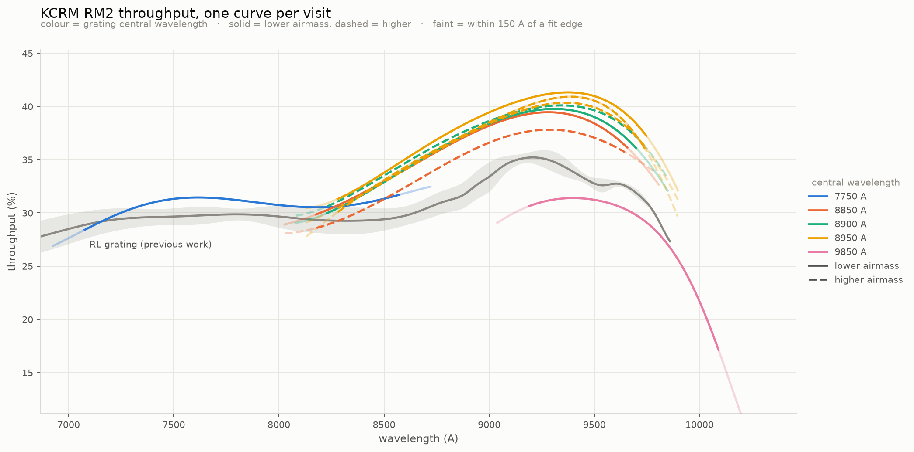

# RM2: what differed from the RL, RH1, RH2, RH3, RH4 and RM1 runs

Only the deltas. The pipeline itself is [PYPEIT.md](PYPEIT.md) and
[THROUGHPUT_PROCEDURE.md](THROUGHPUT_PROCEDURE.md); the missing-template argument
is [RH1_WAVELENGTH.md](RH1_WAVELENGTH.md) and is not repeated here.

Written 2026-08-26, PypeIt 2.0.1, spectrograph `keck_kcrm`.

**STATUS: COMPLETE.** All nine configurations reduced (34/36 frames), nine cubes,
nine sensfuncs at polynomial order 5. Peak throughput **41.3% at 9374 A**, the
highest measured anywhere in this project -- RM1 peaked at 34.8% and RL at 29.5%.
Three templates serve the run: PypeIt's own at 9850, one bootstrapped Medium
template at 8850/8900/8950, and one holy-grail-seeded Small template at 7750.

Scope: **9 nights, 9 science configurations, 36 standard-star frames** (35 after
the 10 s floor), five central wavelengths, two slicers, two stars.

RM2 is the reddest run in this project — the union of its detectors reaches
~6750-10850 A — and it is the run where **the arc line list runs out**, which
changes what "a good wavelength solution" is allowed to look like (section 3).

---

## 1. Nine configurations, five central wavelengths, two slicers, two stars

| config | cenwave | slicer | binning | frames | exposures | star |
|---|---|---|---|---|---|---|
| 2024-05-09 A | 7750 | Small | 1x1 | 3 | 120 s each | feige34 |
| 2024-06-10 A | 8850 | Small | 1x1 | 6 | 10 s each | feige110 |
| 2024-12-24 A | 8850 | Small | 1x1 | 4 | 10, 20, 20, 20 | feige 34 |
| 2024-01-04 B | 8900 | Medium | 2x2 | 3 | 120 s each | feige34 |
| 2024-04-30 B | 8900 | Medium | 2x2 | 3 | 150 s each | feige34 |
| 2024-06-11 B | 8950 | Medium | 2x2 | 4 | 25, 40, 40, 40 | feige34 |
| 2025-01-01 B | 8950 | Medium | 2x2 | 4 | 66, 68, 35, 35 | feige34 |
| 2025-01-02 B | 8950 | Medium | 2x2 | 3 | 35 s each | feige34 |
| 2023-09-23 B | 9850 | Medium | 2x2 | 6 | 3, 30, 60 x4 | feige110 |

Every night carries exactly ONE science configuration. Six of the nine also
carry a stray group — FPCam or bare darks and biases at `cenwave 0.0` or
15757/24009 A, zero science frames — which is the normal KCRM pattern
(RH3.md, RM1.md section 1) and is skipped without gating.

**The science setup is not always B.** On 2024-05-09, 2024-06-10 and 2024-12-24
it is lettered A, because those three nights have no stray group for PypeIt to
letter first. Filter on the science-frame count, never on the letter.

Three structural facts follow, and each one is new to this run:

**Three nights at one central wavelength.** 8950 has 2024-06-11, 2025-01-01 and
2025-01-02. RM1's strongest reproducibility test was a night *pair*, twice; a
triple gives three pairwise shape comparisons, and an order that holds two of the
three has not held. This is what `order_study_rm2.py` reads.

**Two stars, differing between the two nights of one cenwave.** 8850 is feige110
on 2024-06-10 and feige 34 (as the header spells it, with a space) on 2024-12-24.
No single setup mixes stars, so the per-star reduction passes never fire — but
the 8850 comparison is cross-STAR, so an error in either archival spectrum enters
it as shape disagreement. It corroborates and never decides.

**The central wavelengths cluster.** 8850, 8900 and 8950 sit 50 A apart, inside
one 1994 A exposure width, so slices from one are legitimate seeds for another.
That is what makes section 4's single Medium template possible. It also means
cenwave must be rounded to 10 A and never 50, or three grating angles merge.

---

## 2. The shipped template works at one central wavelength in five

`keck_kcwi.py::config_specific_par` maps dispname RM2 to `keck_kcrm_RM2.fits`,
and RM2 is one of the four setups `keck_kcwi.py:1231` lists as supported.

```
shipped keck_kcrm_RM2.fits    8608.0 - 10595.0 A   (2064 px, binspec 2, 0.9659 A/px)
                                                   centre 9601 A
an RM2 exposure                1994 A wide         (2064 binned px x 0.9659)
```

so coverage is set entirely by where the grating was pointed:

```
cenwave 9850   87%        cenwave 8900   65%
cenwave 8950   67%        cenwave 8850   62%
                          cenwave 7750    7%
```

Gated against the SHIPPED template, **one configuration of five settings passes**:

```
config          cenw  slicer  overlap  solved  what happened
2023-09-23 B    9850  Medium    87%    24/24   CLEAN, dispersions agree to 0.4%
2025-01-01 B    8950  Medium    67%     5/24   flat crashed
2024-06-11 B    8950  Medium    67%     2/24   flat crashed
2024-01-04 B    8900  Medium    65%    12/24   flat crashed; 8 of the 12 carry
                                               disp 0.66-0.83 vs the true 0.975
2024-04-30 B    8900  Medium    65%      -     flat crashed
2024-06-10 A    8850  Small     62%     0/24   nothing solved at all
2024-12-24 A    8850  Small     62%      -     not run (see below)
2024-05-09 A    7750  Small      7%      -     not run (see below)
```

The last two were deliberately **not** gated against the shipped template. Its
Small-slicer verdict was already measured on 2024-06-10 at the same central
wavelength -- 0 of 24, nothing at all -- and 7750 sits at 7% coverage, where the
question is not open. A 1x1 calibration run costs ~30 minutes of the same
machine that has the Medium group to reduce.

RM1 measured 65% not enough and 74% not enough across a slicer change, and
inferred nothing sharper. **RM2 brackets the Medium threshold between 67% and
87%.**

**And unlike RM1, the failure is loud.** At 8950 `full_template` logged `Not
enough useful IDs` on 22 of 24 slices and the flat field died with
`ValueError: zero-size array to reduction operation minimum`. That is RH1's
accidental safety net — unsolved slices crashing the flat — which RM1 section 3.1
had to report as absent. Here it fires on every failing Medium config, so nothing
silently reached a throughput curve.

What it does NOT protect against is the 8900 case: 12 slices returned a fit and
**8 of them carry dispersions of 0.66-0.83 A/px against the 0.975 their siblings
agree on**, with spans of ~1200 A instead of ~2000. The span window
(1700-2300 A) rejects them; RMS does not (0.06-0.12 px on some).

---

## 3. The arc line list runs out, and the RMS stops meaning anything

This is the transferable finding of the run.

RM1's FeAr arc, against PypeIt's default FeI/ArI/ArII catalogue, fitted **70-80
lines per slice** at rms 0.200 px. RM2 uses the same lamp and the same catalogue
— `arc = FeAr`, `tilt = ThAr`, checked on all nine setups — and gets:

```
2023-09-23 B (9850, 8822-10999 A)    10-14 lines per slice     rms median 0.026 px
2024-06-11 B (8950, 8016-10067 A)    25-28 lines per slice     rms 0.030-0.057 px
```

The redder the detector, the thinner the list: 0.6 lines per 100 A at 9850
against RM1's ~5. And the setup with the FEWEST lines reports the SMALLEST rms,
which is the "few points, small residual" trap of RH1_PROCEDURE.md arriving as a
whole-configuration property rather than a per-slice one.

Two consequences, both acted on:

**`pick_seed_slits`' `nlines >= 20` had to become a parameter.** At 20, the one
configuration in this run that gated 24/24 reports **zero** slices fit to seed a
template, and the RH3 section-4 bootstrap cannot start. It is now `nline_min`,
defaulting to 20 so no earlier grating moves, and 8 for RM2 — the same treatment
`span` and `shift_tol` already had, for the same reason: it is a property of the
grating and the lamp, not of the code.

**The check that carries the weight is dispersion agreement, not rms.** The 24
slices of one setup are the same grating at the same angle, so their dispersions
must agree to a fraction of a percent whatever the line count. On 2023-09-23 B,
24/24 agree within 0.4% of the median 0.9585 A/px. That, plus night-to-night
agreement at 8850/8900/8950, is what says a 12-line solution is right.

### 3.1 The SHIFTED tolerance, measured for a third grating

`health()` calls a slice SHIFTED when its blue end sits more than 50 A from the
median — a threshold set on RH2 (31.8-38.4 A), extended by RH3 (44.6 A) and made
slicer-dependent by RM1 (Large 84 A, Small 106 A). RM2, on 2023-09-23 B, a setup
gated 24/24 with dispersions agreeing to 0.4%:

```
blue ends       8822.5 - 9029.2 A       union 206.7 A
median          8896.1 A                max |blue - median|  128.4 A
```

in the same clean odd/even comb RM1 measured — alternating ~110 A, which is
slicer geometry, not misidentification. RM1's Large 100 A would fail this correct
setup. RM2 uses **Medium 150 A, Small 180 A**, the Medium value now measured with
22 A of headroom and the Small one still scaled from RM1 pending a clean Small
gate.

`--span` moves too, for the fourth grating running: an RM2 slice spans
**1958-2011 A**, against RM1's ~1453 and the RH1/RH2-derived 400-900 default.

---

## 4. One Medium template, seeded from the wreck of the 8900 gate

The RH3 section-4 play. `keck_kcrm_RM2_8900.fits`:

```
built from   2024-01-04 B (cenwave 8900), spat 53 and spat 1986
range        7871.4 - 10076.7 A   (2255 px, binspec 2, 0.9752 A/px)
width        2205 A = 111% of one RM2 exposure
serves       8900 (100% of the detector) and 8950 (100%)
```

The configuration whose gate FAILED — 12 of 24 slices solved, 8 of those
wrong — is the configuration that seeded the template that fixes it. "FAIL 12/24"
reads like a dead end and is not one.

**Both seeds come from ONE night on purpose.** 2024-04-30 (8900) and all three
8950 nights are then independent tests of whether the template generalises,
rather than reproductions of the arc it came from — RH3 section 9's requirement.

9850 keeps PypeIt's own template, which gates clean there at 87% coverage.

### 4.1 The seeds are verified, not merely self-consistent

`check_seed_agreement.py` cross-correlates the *observed arc spectrum* of a seed
slice against an independently solved slice from another night at another central
wavelength, on a common wavelength grid. A misidentification moves a solution by
about a line spacing, so this is the test that a tight RMS cannot substitute for:

```
seed 2024-01-04 spat   53   vs  2024-06-11 spat  881   overlap 8016-9889 A
   offset 0.07 A    tolerance 2.28 A (25% of the 9.1 A line spacing)   AGREE
seed 2024-01-04 spat 1986   vs  2024-06-11 spat 1676   overlap 8071-10067 A
   offset 0.02 A    tolerance 1.14 A (25% of the 4.6 A line spacing)   AGREE
```

Different night, different grating angle, different slice, solved from a
different template — and the arc features land within 0.07 A. At 9 lines fitted
(spat 53) that is the only evidence available that the solution is right, and it
is stronger evidence than any RMS.

---

## 5. The Small/1x1 configurations, and why RH2's slicer rule did not apply

7750 and 8850 are Small slicer, 1x1 binning, and neither had a template. The
shipped one covers 62% of an 8850 detector and **7%** of a 7750 one, and
2024-06-10 A returned **0 of 24** slices against it.

### 5.1 One Medium-seeded template serves both slicers at 8850

`keck_kcrm_RM2_8900.fits` was built from Medium/2x2 slices, and RH2.md's finding
is that a template holds as single features the blends another slicer resolves --
"a template cannot serve two slicers". Tested rather than assumed, on both 8850
nights:

```
config          slicer      overlap  solved  rms med  disp range      spread
2024-06-10 A    Small 1x1     99%    24/24   0.259    0.4873-0.4893   0.24%
2024-12-24 A    Small 1x1     99%    24/24   0.385    0.4870-0.4888   0.18%
```

Both pass, and the dispersions are **half the Medium 0.9752 A/px to within
0.2%** -- 0.4885 and 0.4881 against 0.4876 expected -- which is the check that
says a solution is physically right rather than merely tight.

**The RH2 rule's real variable is line spacing versus the resolution
difference, not the slicer name.** RH2 measured it on a high-dispersion RH
grating, where changing resolution blends neighbouring lines. Out here RM2's FeAr
lines sit 5-9 A apart against 0.49 A/px sampling; there is nothing to blend.

2024-12-24 is also an independent night carrying a *different star*, so the 8850
pair tests generalisation twice over.

### 5.2 7750 needed holy-grail, and holy-grail found it easy

Gated against the Medium template at 44% coverage, 7750 produced the
partly-wrong-solution signature rather than a clean failure: 19 of 24 slices
returned a physically possible span, but their dispersions scatter 0.4829-0.5348
with **only 9 of 19 inside 2%** of the median.

So `holy_seed_rm2.py` ran holy-grail on it -- no template at all -- and the
result inverts the expectation set by RH1, where holy-grail managed 1 slice of 24:

```
2024-05-09 A   24/24 solved   39-52 lines per slice   rms median 0.111 px
               dispersions 0.4965-0.4987 (0.44% spread)   run_pypeit rc=0
```

A complete calibration, flat included. The reason is section 3 running the other
way -- **at 7750 A the FeAr catalogue is still rich**:

```
cenwave 7750    39-52 lines per slice
cenwave 8850    19-23
cenwave 8950    22-28
cenwave 9850    10-14
```

The configuration with the worst template coverage in the run (7%) is the
easiest to solve from scratch, and the one with the best coverage (87%) has the
thinnest arc. Line density, not coverage, is what decides whether holy-grail can
work.

`keck_kcrm_RM2_7750_small.fits` (6678.8-8968.7 A, 4617 px, 0.4974 A/px, 100% of
an exposure) was seeded from two of those slices, and gating 2024-05-09 against
it returns 24/24 at **rms median 0.087 px, the best of the run**. That gate is a
reproduction, not a generalisation -- the template came from the only night at
this setting -- so the independent evidence is a cross-check against a different
night, different grating angle and different template:

```
holy-grail 7750 spat 3965  vs  full_template 8850 spat 104
   overlap 7799-8969 A   offset 0.08 A   tolerance 2.91 A   AGREE
```

Two unrelated routes to a wavelength scale, agreeing to 0.08 A.

A template is used rather than the holy-grail products directly for a reason
beyond procedure: holy-grail is stochastic, so reducing science against it makes
the reduction unreproducible. The template is a checked-in artifact.

### 5.3 The 3.4 arcsec aperture holds on Small too

A Small cube is 8" x 20" at 0.339"/spaxel, so a 3.4"-radius aperture spans 6.8"
of the 8" axis and `check_cube`'s concentration reads much lower than on Medium
-- 76.7% of surround on 2024-06-10 against 98% typical. That is the field, not a
clipped star. Curve of growth, flux normalised to its own 3.4" value:

```
config                  spaxel   1.0"   1.7"   2.4"   3.4"   4.5"   6.0"   field
8850 n1 Small feige110   0.339  0.711  0.888  0.936  1.000  1.063  1.131   8"x20"
8850 n2 Small feige34    0.339  0.738  0.938  0.971  1.000  1.024  1.050   8"x20"
8900    Medium feige34   0.679  0.793  0.937  0.977  1.000  1.004  1.007  23"x25"
```

The Medium curve converges (1.004 at 4.5", 1.007 at 6"); the Small ones keep
climbing 5-13%. That climb is not starlight: at the 1.0-1.4" seeing these frames
carry, a 3.4" radius is 2.4-3.4 FWHM and encloses over 99% of the PSF. It is
background accumulating over a narrow field as the radius grows, which is also
why the concentration ratio reads low. 3.4" stands on both slicers.

---

## 6. Tools

| file | purpose |
|---|---|
| `RM2 pypeit run/setup_rm2.sh` | `pypeit_setup -c all` for all nine nights |
| `RM2 pypeit run/run_rm2.py` | setup to spec2d: template check, sky regions, `run_pypeit` |
| `RM2 pypeit run/run_rm2_throughput.py` | spec2d to throughput; `--boxcar` in arcsec, `--bridge 5` |
| `RM2 pypeit run/order_study_rm2.py` | refit the 8950 triple and the 8900/8850 pairs at several orders |
| `pypeit_test/gate_rm2_template.py` | run calibrations against a template and judge the result |
| `pypeit_test/build_rm2_template.py` | bootstrap a template from the good slices of a failed config |
| `pypeit_test/holy_seed_rm2.py` | holy-grail with no template, for the Small configs |
| `pypeit_test/check_seed_agreement.py` | verify a seed against an independent night (section 4.1) |
| `pypeit_test/plot_rh1_throughput.py` | the figure: `-g RM2 --sens-glob "*_sens_IR_p5cov.fits"` |

---

## 7. Results



Nine visits, five central wavelengths, 34 of 36 science frames. Peak throughput
**41.3% at 9374 A** -- the highest in this project, against RM1's 34.8% and RL's
29.5%. Peaks are taken 150 A inside each fit edge, the same interior the figure
draws solid.

| config | cenw | slicer | airmass | fit range (A) | peak | peak at | mean | interior scatter |
|---|---|---|---|---|---|---|---|---|
| 2024-05-09 A | 7750 | Small | 1.09 | 6927-8721 | 31.7% | 8571 * | 30.8% | 0.0207 |
| 2024-06-10 A | 8850 | Small | 1.21 | 8029-9795 | 37.8% | 9287 | 34.5% | 0.0650 |
| 2024-12-24 A | 8850 | Small | 1.13 | 8027-9806 | 39.5% | 9281 | 36.0% | 0.0316 |
| 2024-01-04 B | 8900 | Medium | 1.20 | 8081-9850 | 40.1% | 9345 | 37.0% | 0.0221 |
| 2024-04-30 B | 8900 | Medium | 1.10 | 8079-9849 | 39.8% | 9309 | 36.5% | 0.0254 |
| 2024-06-11 B | 8950 | Medium | 1.25 | 8130-9897 | 40.9% | 9388 | 37.2% | 0.0756 |
| 2025-01-01 B | 8950 | Medium | 1.10 | 8129-9898 | 41.3% | 9374 | 38.0% | 0.0186 |
| 2025-01-02 B | 8950 | Medium | 1.10 | 8129-9898 | 40.4% | 9364 | 36.9% | 0.0236 |
| 2023-09-23 B | 9850 | Medium | 1.25 | 9038-10241 | 31.4% | 9399 | 28.4% | 0.0411 |

`*` 7750's curve is flat over its whole range (31.2% at 7800, 30.9% at 8400), so
its "peak" is simply the red end of the fitted interior and means nothing.

At fixed wavelengths, which is the comparison that does not depend on where each
config's range happens to fall:

```
                 7000A    7800A    8400A    9000A    9600A   10200A
2024-05-09 7750  27.6%    31.2%    30.9%        -        -        -
2024-06-10 8850      -        -    30.3%    36.6%    36.2%        -
2024-12-24 8850      -        -    31.9%    38.2%    37.1%        -
2024-01-04 8900      -        -    32.3%    38.6%    38.7%        -
2024-04-30 8900      -        -    31.7%    38.4%    37.9%        -
2024-06-11 8950      -        -    31.8%    38.5%    39.4%        -
2025-01-01 8950      -        -    32.6%    39.4%    40.1%        -
2025-01-02 8950      -        -    31.8%    38.4%    38.9%        -
2023-09-23 9850      -        -        -        -    30.7%    11.0%

  @8400 A   mean 31.6%   std 0.7%   (8 configs)
  @9000 A   mean 38.3%   std 0.8%   (7 configs)
  @9600 A   mean 38.3%   std 1.3%   (7 configs, 9850 excluded -- see 7.2)
```

**RM2's response rises steeply across its band**: ~28% at 7000 A, ~31.6% at
8400 A, ~38.3% at 9000-9600 A, peaking near 9350 A, then collapsing past 9700 A
to 11% at 10200 A -- silicon QE running out. The union of fitted ranges covers
6927-10241 A.

Configs at different grating angles agree where they overlap: at 8400 A eight
configs spanning 7750-8950 read 30.3-32.6%, a 0.7% standard deviation across four
grating angles, two slicers and two stars.

### 7.1 The night groups reproduce, and that is what validates the templates

```
cenwave 8950 (three nights, one bootstrapped template, none of them its seed)
   2024-06-11   peak 40.9% @ 9388 A   mean 37.2%
   2025-01-01   peak 41.3% @ 9374 A   mean 38.0%
   2025-01-02   peak 40.4% @ 9364 A   mean 36.9%
   -> peaks agree to 0.9 points and 24 A

cenwave 8900 (two nights; one seeded the template, one did not)
   2024-01-04   peak 40.1% @ 9345 A   mean 37.0%
   2024-04-30   peak 39.8% @ 9309 A   mean 36.5%
   -> 0.3 points, 36 A

cenwave 8850 (two nights, two DIFFERENT STARS, Small slicer)
   2024-06-10 feige110   peak 37.8% @ 9287 A   mean 34.5%
   2024-12-24 feige 34   peak 39.5% @ 9281 A   mean 36.0%
   -> 1.7 points, 6 A
```

This matters more here than on earlier gratings, because at RM2's line density a
wrong wavelength solution still returns a small rms (section 3). Five nights
reduced against a template seeded from a sixth, agreeing on peak position to
under 40 A, is the evidence that the bootstrap is right.

The 8850 pair's 1.7-point offset is the largest of the three groups and is
cross-star, so it cannot be separated from an archival-spectrum difference. Note
it does NOT support a slicer term: at 9000 A the Small configs read 36.6% and
38.2% against the Medium 38.4-39.4%, i.e. 1-5% low, well short of the 6-8%
established for RL and RH1. RM2 has no night carrying both deckers at one
cenwave, so it cannot measure that term and should not be read as contradicting
it either.

### 7.2 2023-09-23 is a non-photometric night, and the fixed-wavelength column proves it

9850 reads 30.7% at 9600 A where the other seven configs read 36.2-40.1% -- 20%
low **at the same wavelength**, which no grating-angle argument explains. The
cause is in the frames: over nine minutes its five exposures fade monotonically
while airmass and seeing both improve.

```
   30s  AM 1.25  seeing 1.36"   1,227,110 cts/s
   60s  AM 1.24  seeing 1.04"   1,072,578
   60s  AM 1.24  seeing 1.10"   1,028,592
   60s  AM 1.23  seeing 0.99"     876,530
   60s  AM 1.22  seeing 0.91"     890,100
```

Seeing cannot do this: sharper seeing puts *less* light in the sky window, so it
would push the measured flux up, and the sharpest frames are the faintest. Thin
cirrus is grey and independent of seeing, and fits. **9850 is a lower limit**, and
it is the only coverage at that setting. Scaled by the brightest frames it would
read ~35-38%, in line with the rest -- so this run does not establish that RM2's
efficiency falls off at 9850, only that this night was cloudy.

Its cube grid is also 813 rows (552") against 37 for the Medium norm, all the
flux sitting in rows 9-38 (20.4"), with the star holding 97.6% of its
surroundings. That is the oversized-grid phenomenon RH2 measured as harmless
(553-1307 spaxels there), and the extraction is unaffected.

### 7.3 Two frame-level defects that no exposure-time rule can catch

**A starless frame with a 66 s exposure time.** 2025-01-01 B's first frame
carries 20,895 cts/s of total sky-subtracted signal against 4.64-4.74 MILLION for
the other three -- a factor of 225 -- at GUIDFWHM 2.15". It is an acquisition
frame, and it passes the 10 s floor with 56 s to spare. Coadded, it cost 9 points:
29.3% against the 38.0% and 38.3% of the other two nights at the same cenwave,
with the peak position untouched (9378 A against 9364 and 9388). A grey deficit
with correct shape is indistinguishable from a cloudy night unless the frames are
checked one by one.

`run_rm2_throughput.py` now drops frames under 0.20x the group median count rate,
yielding at two frames like the exposure floor. Across every other RM2 Medium
frame the measure sits at 4.58-4.79 M cts/s -- a 4% spread over four nights and
two cenwaves -- so the threshold is nowhere near delicate.

The measure must be **aperture-free**: sum(SCIIMG - SKYMODEL) over the whole
frame, divided by EXPTIME. A concentration-weighted proxy such as the brightest N
pixels tracks SEEING as much as flux, and would have called 2024-06-11's 1.0"
frames five times brighter than 2025-01-02's 1.3" ones, when aperture-free they
agree to 1%. RM1 section 8.3 records the same trap.

**Sky regions that were right for only part of a sequence.** 2023-09-23 B nods
1.2" mid-sequence (RAOFF/DECOFF 0,0 -> -0.7,+1.0), and
`find_object_regions.py`, run per frame, does not agree across it:

```
   frames 1-3   brightest slice 12   object 44-57%   -> :38,65:
   frames 4-5   brightest slice 11   object 38-51%   -> :31,59:
```

RM1's driver derived ONE window per star per configuration and reduced every
frame against it, so the nodded frames had part of the star's wing inside the
region declared sky. `run_rm2.py` now keys the reduction pass on
**(star, pointing)** and clusters groups whose windows agree within
`--region-tol`, so a nod too small to move the star costs no extra pass.

Measured, this is worth **+2.0% and +2.3%** on the two nodded frames -- real, and
much smaller than the 17% step at the nod, which the count-rate table above shows
is the cirrus. Worth recording precisely because the two effects look identical
in the throughput curve: both are grey, both leave the peak in place. Only
per-frame numbers separate them.

### 7.4 Polynomial order 5, settled on the 8950 triple

`order_study_rm2.py`, orders 3/5/7/9/15, worst pairwise value in each group:

```
                8850 (cross-star)      8900                  8950 (triple)
order  A/DOF  shapeRMS d(pk) inter   shapeRMS d(pk) inter   shapeRMS d(pk) inter
    3    442     0.95%   48A 0.0479     0.72%   33A 0.0230     0.95%   26A 0.0384
    5    295     0.66%    7A 0.0483     0.62%   37A 0.0238     0.68%   26A 0.0393
    7    222     0.63%    7A 0.0480     0.84%   63A 0.0243     2.97%   74A 0.0336
    9    177     0.69%    7A 0.0478     0.93%   99A 0.0241     4.12%   62A 0.0275
   15    111     1.37%  118A 0.0475     1.08%   74A 0.0231     5.91%  103A 0.0239
```

Order 5 is best or tied on all three groups. The 8950 triple decides it: shape
agreement degrades from 0.68% to 2.97% at order 7 and 5.91% at order 15, **while
interior scatter falls monotonically 0.0384 -> 0.0239**. That is the trap RH3 and
RM1 both document, now confirmed a third time -- the statistic the fit reports
about itself points at 15, and 15 is nine times worse at the measurement.

RM2 also breaks the A-per-degree-of-freedom heuristic for a second time. Its
~1990 A range makes order 5 = 295 A/DOF, *stiffer* than the 227 that worked on RL,
which argues for promoting the order to 7 (222) -- and order 7 is four times worse
on the 8950 triple. The ratio is a way to generate a candidate, never to choose.

Within the triple, the two consecutive January nights agree far better than either
does with June (0.20-0.25% against 0.55-0.95%), at every order.

### 7.5 What the interior scatter is, and is not

It runs 0.019-0.076 mag across the nine configs. The two worst are 2024-06-11
(0.076) and 2024-06-10 (0.065).

It is **not** telluric-driven, which was the obvious guess in a band full of OH
and H2O: scatter is *anti*-correlated with humidity. The two wettest nights
(2025-01-01 and 2025-01-02, 23-29% outside humidity) give the two lowest figures,
0.019 and 0.024, and the driest night in the run (2024-06-10, 5.9%) gives 0.065.

It loosely tracks airmass -- every config above 0.04 sits at airmass >= 1.19 --
but 2024-01-04 at airmass 1.20 reads 0.022, so that does not hold either.
Flagged rather than diagnosed, as RM1 section 8.5 flagged its own worst config.

---

## 8. What would improve this measurement

**A second 9850 visit.** The only night at that setting is cloudy, so RM2's
behaviour beyond 9900 A rests on one non-photometric sequence. Everything the
figure shows redward of 9700 A should be treated as provisional.

**One night carrying both deckers at one cenwave**, as RL 2024-12-04 does. RM2
has two slicers and no overlap, so the 6-8% slicer term established elsewhere can
be neither confirmed nor measured here.

**A same-star 8850 pair.** The existing pair differs by star, which is the one
group whose 1.7-point offset cannot be attributed.
