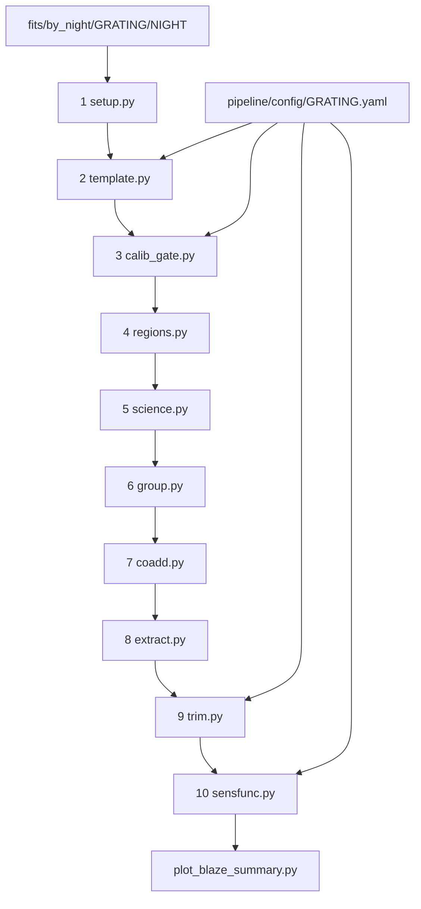

# Reducing a KCRM throughput night

Ten steps. You run one, read what it prints, then run the next. Nothing here
runs the whole night for you, and nothing writes into `results/`. Those
folders are the published reductions. A new night goes to
`reductions/<grating>/<night>/`.

The grating file `pipeline/config/<GRATING>.yaml` already holds the numbers
that are the same for every night of that grating. You do not retype them,
and you do not paste them into a `.pypeit` file. The step that needs a number
copies it.

PypeIt is 2.0.1. Run the steps with that environment's Python. It has the
packages the cube and count-rate steps import, and its `bin` directory is
where the commands are. The default is `/opt/miniconda3/envs/pypeit/bin`.

```bash
export PYPEIT_BIN=/opt/miniconda3/envs/pypeit/bin
```

If the binaries live somewhere else, point `PYPEIT_BIN` there. Each step prints
the next command using that same Python, so the first command is the one to
copy carefully. Run every command from the repository root.




## What each step is for


| Step | Command         | One of these                                           | Stop when                                                     |
| ---- | --------------- | ------------------------------------------------------ | ------------------------------------------------------------- |
| 1    | `setup.py`      | one night                                              | a setup has no arc, trace, pixelflat, or align frames         |
| 2    | `template.py`   | one setup                                              | the central wavelength and slicer are not in the grating file |
| 3    | `calib_gate.py` | one setup                                              | the report is not 24/24                                       |
| 4    | `regions.py`    | one setup, measured on one frame per star and pointing | `NO DETECTION`                                                |
| 5    | `science.py`    | one setup, one spec2d per exposure                     | `run_pypeit` fails                                            |
| 6    | `group.py`      | one cube, which is some of the setup's exposures       | a group has fewer than 2 frames                               |
| 7    | `coadd.py`      | one cube                                               | the WCS is a degree per spaxel                                |
| 8    | `extract.py`    | one cube                                               | the extraction fails                                          |
| 9    | `trim.py`       | one cube                                               | `measure_trim.py` fails                                       |
| 10   | `sensfunc.py`   | one cube                                               | the fit fails                                                 |


A setup is one night and one PypeIt letter (`2023-11-08` / `A`): one grating,
one slicer, one binning, one central wavelength, and every exposure that
shares them. A cube is smaller than that. Two visits four hours apart, or two
standards in the same setup, become two cubes.

These are fixed for every grating and are not in the grating file: spectrograph
`keck_kcrm`, `combine = True`, algorithm `IR`, extraction `BOX`, trim fraction
0.20, trim pad 10 pixels, and a pointing split at 3 arcsec. A 1.2 arcsec nod
stays one visit. A 3.3 arcsec repoint becomes two.

## 0. The night has to be on disk

```bash
python download/download_std_red.py --stars feige110 --same-night --gratings RH1 --nights 2026-01-15
```

That writes `fits/by_night/RH1/2026-01-15/`. The date is the Keck night, not
the UT date.

## 1. Sort the night

```bash
$PYPEIT_BIN/python pipeline/setup.py --grating RH1 --night 2026-01-15
```

Read the list of setups. A letter with no science frames, or with science but
no arc, trace, pixelflat, or alignment frames, is not a standard. Setup A on
an otherwise good night is often that. The dispname has to be RH1; a stray
setup in another grating is printed and then left alone.

Under each science setup the step prints the next command. Run that for the
science setup, not for every letter.

## 2. Point the setup at its template

```bash
$PYPEIT_BIN/python pipeline/template.py --grating RH1 --night 2026-01-15 --setup B
```

The print names the central wavelength rounded to 10 Å, the slicer, the
template file, and the line list. Check those against
`pipeline/config/RH1.yaml`.

If `6520 Large` is missing from `templates:`, the step stops. Build the
template with the existing script for that grating (`archive/pypeit_test/build_rh1_template.py`
and its `gate_rh1_template.py`, and the same pair for the other gratings),
add one line to the grating file, and run this step again. A template is one
per central wavelength and slicer. It is not one per night.

For RH3 and RH4 the line list is `ThArRH3` or `ThArRH4`. This step comments
out the FeAr arcs and marks the ThAr frames `arc,tilt`. The default iron/argon
list is too thin at those wavelengths: a fit can report a small RMS on a
handful of lines and still be the wrong solution.

`shipped` in the grating file means PypeIt's own file, written into the
`.pypeit` by filename (`keck_kcrm_RL.fits`), not as a path into the download
cache. RL uses that for every setting. RM1 uses it only at 6630. RM2 uses it
only at 9850. The shipped RH3 file does not solve these data; RH3's entries
are local files.

If this step changes the template, the line list, or `exclude_regions`, it
deletes `Calibrations/`. PypeIt keys calibrations by frame, so an old solution
would otherwise be reused.

## 3. Calibrate, and require 24 slices

```bash
$PYPEIT_BIN/python pipeline/calib_gate.py --grating RH1 --night 2026-01-15 --setup B
```

The print has to say `24/24 slices usable`. The span window and the shift
tolerance come from the grating file. They were measured once, on a setup
already known to be solved, and every later night of that grating reuses them.

- Not 24 slices, usually 25: the dead column at detector column 653 fell
inside a lit slice. Add one line under `exclude_regions` for this night and
letter. The value ends with a comma. RH1 2023-11-08 A is `1:652:655,`.
RM1 2024-04-01 B is `1:642:656,`. Same column, different window, because the
central wavelength moves the slice. Then run `template.py` again and
`calib_gate.py --rerun`.
- 24 slices of which fewer are usable, or any line that says `SHIFTED`: the
template was matched to the wrong window. A slice can keep a normal width
and a small RMS while sitting 200 Å from its neighbours. Do not go on.

`--rerun` deletes `Calibrations/` and calibrates again. Without it, an existing
`WaveCalib` is only reported.

## 4. Measure the star

```bash
$PYPEIT_BIN/python pipeline/regions.py --grating RH1 --night 2026-01-15 --setup B
```

This writes `object_regions.txt` in the setup directory and one
`user_regions` line into the `.pypeit`. It is not written into the grating
file. The frame it measures is the longest science exposure that clears the
10 s floor, per star and per pointing rounded to 0.1 arcsec. Two standards in
one setup, which is what RH4 is, are measured separately. A 1.2 arcsec nod
whose window actually moves is also measured separately.

`NO DETECTION` means that frame has no star. That group is not reduced. A
window wider than about 85 percent of the slice is the same failure: the
finder refuses to emit `:0,100:`, which would declare the whole slice to be sky.

Windows within 3 percent of a slice share one reduction pass.

## 5. Reduce the science frames

```bash
$PYPEIT_BIN/python pipeline/science.py --grating RH1 --night 2026-01-15 --setup B
```

One `spec2d` per exposure. If the sky windows did not agree, this runs one
pass per window and comments the other star's rows out while it does. The
calibrations stay. Frames under 10 s stay commented, unless dropping them
would leave fewer than two frames. That yield is how RM1 2023-12-09 B (7 s and
14 s, the only 6480 coverage) survives.

A setup that already has its `spec2d` files is skipped. `--rerun` reduces
again.

## 6. Decide which exposures share a cube

```bash
$PYPEIT_BIN/python pipeline/group.py --grating RH1 --night 2026-01-15 --setup B
```

The print is one line per cube: star, frame count, airmass range. A group of
one frame is `REFUSED` and no `.coadd3d` is written. `combine = True` on a
single frame is rejected by PypeIt, and the alternative writes a WCS of one
degree per pixel, which inflates the extracted counts.

RM2 also drops a frame whose sky-subtracted counts per second are under 0.20
of that star's median. The 66 s frame on 2025-01-01 has an exposure time above
the floor and no star. Other gratings have `count_rate_floor: null` and skip
this cut. The cut is per star, so two standards are not compared with each
other.

Two cubes are still one run of each later step. A night split by airmass or by
a pointing change prints two lines and writes two files, for example
`g191b2b_2026-01-15_B_v1.coadd3d` and `g191b2b_2026-01-15_B_v2.coadd3d`. Run
`coadd.py`, `extract.py`, `trim.py`, and `sensfunc.py` once each, with the same
`--grating`, `--night`, and `--setup`. Each command finds both files and
finishes `_v1` before it starts `_v2`. Do not start a second job for the second
cube. `--tag g191b2b_2026-01-15_B_v1` limits a command to one of them.

## 7. Build the cube

```bash
$PYPEIT_BIN/python pipeline/coadd.py --grating RH1 --night 2026-01-15 --setup B
```

If `group.py` wrote two `.coadd3d` files, this command builds both, in order.
`combine = True` stacks the listed spec2d files onto one RA, Dec, and
wavelength grid. The print gives the cube shape, the spaxel in arcsec, and
what fraction of the nearby flux sits inside the 3.4 arcsec aperture. A
degree-scale CDELT stops the step. A star that is not compact is a warning:
look at the whitelight image before extracting.

## 8. Extract

```bash
$PYPEIT_BIN/python pipeline/extract.py --grating RH1 --night 2026-01-15 --setup B
```

BOX extraction at `boxcar_arcsec` from the grating file. That number is 3.4
for every grating, including a future RL night. The published RL curves were
extracted with the old 4σ aperture and are not recomputed by this.

The radius is in arcsec. Left unset, PypeIt sizes the aperture as 4σ in
spaxels, and a spaxel is 1.358 arcsec on Large/2x2 and 0.339 arcsec on
Small/1x1.

## 9. Trim

```bash
$PYPEIT_BIN/python pipeline/trim.py --grating RH1 --night 2026-01-15 --setup B
```

Writes `<tag>.trim` with `trim_std_pixs`. Two cuts, then 10 pixels of pad.
The counts cut keeps the longest run above 20 percent of the 95th percentile.
`bridge` pixels, from the grating file, are allowed inside that run: RH3, RM1,
and RM2 use 5, because one bad pixel otherwise throws away a few hundred
angstroms. The other gratings use 0. Turn bridge on for a new grating only
after a trim report shows a good stretch cut at a one-pixel hole.

The second cut keeps only wavelengths recorded by every slice of every spec2d
in the cube. The cube's own ends are filled by resampling and are not flux.

The red number has to be at least 1. PypeIt indexes `trim_gpm[blue:-red]`, so
0 masks the whole spectrum.

## 10. Sensitivity

```bash
$PYPEIT_BIN/python pipeline/sensfunc.py --grating RH1 --night 2026-01-15 --setup B
```

One cube at a time, even if the setup has several. Two of these running at
once have collided on the telluric cache and died on a half-written file.
The polynomial order is the grating file's: 15 for RL, RH1, RH2, and RH4;
5 for RH3, RM1, and RM2. The product is
`<star>_<night>_<setup>[_vN]_sens_IR_p<order>cov.fits`.

`_vN` is added only when that star has more than one cube in the setup.

## After the fit

Compare the new cube with a good night of the same star before it enters the
mean. A cube that is low in raw counts, with extinction already removed, is a
cloud measurement. Add its tag under `drop:` in the grating file. The three
already there are `g191b2b_2023-11-07_B`, `feige34_2024-03-13_B`, and
`feige110_2023-09-23_B`. `flag:` is the weaker mark: the cube stays in the
mean and is labelled a lower limit. RM1 `feige34_2024-03-15_B` is the one.

Then:

```bash
$PYPEIT_BIN/python pipeline/utils/plot_blaze_summary.py
$PYPEIT_BIN/python pipeline/utils/blaze_tables.py --render
```

The plot reads the historical trees and any new sensfunc under `reductions/`.
If a new file has the same name as a published one, the published file is the
one that is plotted.

## The grating file


| Key                                                                    | Scope                                                                 | Where the number came from                                                          |
| ---------------------------------------------------------------------- | --------------------------------------------------------------------- | ----------------------------------------------------------------------------------- |
| `polyorder`                                                            | every night of this grating                                           | an order test on a night pair                                                       |
| `bridge`                                                               | every night of this grating                                           | 0 until a trim report shows a one-pixel hole                                        |
| `lamps`                                                                | every night of this grating                                           | `null` unless the arc is ThAr                                                       |
| `slice_span_A`                                                         | every night of this grating                                           | min and max wavelength of one good slice, plus a margin                             |
| `shift_tol_A`                                                          | every night of this grating, and of this slicer where the map says so | max distance of a slice's blue end from the median, on a 24/24 setup, plus headroom |
| `nline_min`                                                            | every night of this grating                                           | 20, except RM2 at 8 because a correct 9850 slice fits 10–14 lines                   |
| `count_rate_floor`                                                     | every night of this grating                                           | `null`, except RM2 at 0.20                                                          |
| `templates`                                                            | one central wavelength and one slicer, every night at that setting    | the file a gate passed at 24/24                                                     |
| `boxcar_arcsec`, `exptime_floor_s`, `min_frames`, `max_airmass_spread` | written in every grating file so they are visible                     | 3.4 arcsec, 10 s, 2 frames, 0.10 airmass. Same in all seven files                   |
| `exclude_regions`                                                      | one night and one setup, and only after a 25-slice gate               | measured from where the dead column falls                                           |
| `length_range`                                                         | the one RH1 setup whose published file had it                         | 0.3 on 2023-11-08 A, together with `exclude_regions`                                |
| `drop`, `flag`                                                         | one cube                                                              | after comparing nights of the same star                                             |


A missing key stops the step that needs it. A new grating does not inherit
RH1's span or shift tolerance. Copy `pipeline/config/RL.yaml` to a new name,
replace every number from a measurement on that grating, and delete the
template entries you have not gated.

RL's window was measured on the 2024-12-28 B spec2d: one slice spans
3791–3971 Å, and the blue ends sit up to 286 Å from their median. The file
says `[3400, 4500]` and `shift_tol_A: 400`. A wrong window of only ~300 Å can
sit inside that spread, so for RL the report that matters is 24 slices inside
the span, not the shift line.

`shift_tol_A` is a single number, or a map of slicer to number. RM1 is
Large 100 / Small 120. RM2 is Medium 150 / Small 180. An unlisted slicer
stops the gate. It does not fall back to another slicer's value.

## What this does not do

Template building stays in `archive/pypeit_test/build_*_template.py` and
`gate_*_template.py`. Those scripts are how a missing `(cenwave, slicer)`
got a file. This pipeline only inserts a path that is already in the grating
file. The template files themselves stay in `templates/`.

The per-grating drivers under `archive/<GRATING>/` are how the published
curves were made.

## What was checked

`python3 pipeline/test_pipeline.py` checks the grating files, the `.pypeit`
rewrite, the ThAr retype, the exposure floor and its yield, the visit split,
the count-rate cut, and the sensfunc text. It does not run PypeIt. The reader
was also pointed at the published RH1, RH3, RM1, RL, and RH4 `.pypeit` files:
central wavelengths round to the settings in the grating files, the two RH4
stars both appear, and rewriting an RH3 header leaves the data block unchanged,
including the commented FeAr rows.

No new night was reduced to produce this. The steps are valid as a
transcription of the reductions already published, under that condition. A
PypeIt that renames the `.pypeit` columns, or changes what `combine = True`
does, would make the transcription wrong; the gate printout from
`calib_gate.py` is the first place that shows up.