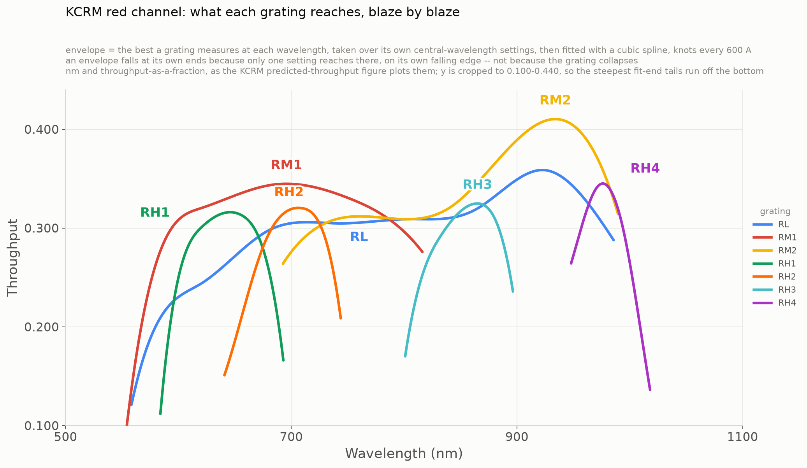
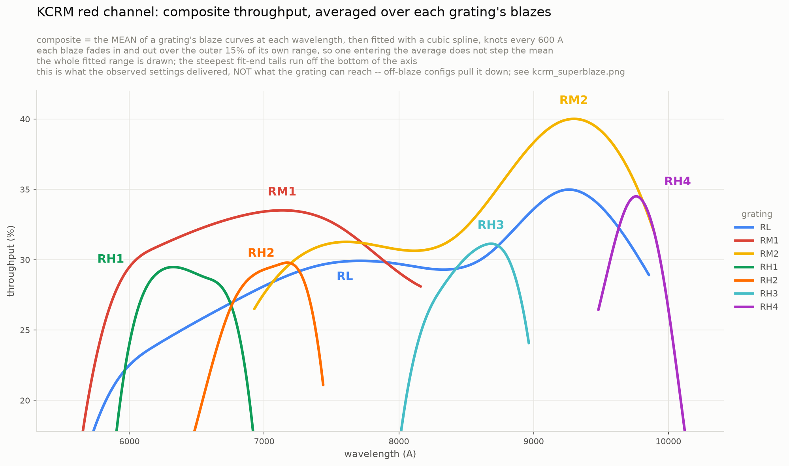

# KCRM red channel: nights, configurations and blazes

Every grating's standard-star run in one place — which nights went in, what
each night was configured as, and what throughput came out. The reductions
themselves are documented per grating in
[RH1_PROCEDURE.md](../archive/RH1_PROCEDURE.md), [RH2.md](../archive/RH2.md), [RH3.md](../archive/RH3.md),
[RH4.md](../archive/RH4.md), [RM1.md](../archive/RM1.md), [RM2.md](../archive/RM2.md) and
[THROUGHPUT_PROCEDURE.md](../archive/THROUGHPUT_PROCEDURE.md) (RL); the pipeline is
[PYPEIT.md](../archive/PYPEIT.md). Nothing here restates those. This is the register.

Written 2026-08-27. Every number in this file is generated by
`pipeline/utils/plot_blaze_summary.py` from the sensfunc files on disk, into
`blaze_summary.csv` (one row per cube), `blaze_peaks.csv` (one row per blaze),
`composite_by_grating.csv` (one row per grating per Angstrom) and
`composite_summary.csv`; `pipeline/utils/blaze_tables.py` renders every table below
from those. Only the prose is written by hand, so the tables and the figures
cannot disagree.

---

## What a "blaze" is here, and why it is the unit

A **blaze** is one grating setting: a *(grating, central wavelength, slicer)*
triple. It is the unit these tables and figures group by, and the two parts of
the key are there for different reasons.

**Central wavelength.** These are blazed gratings. Rotating one to a new central
wavelength moves its peak efficiency with it, so two central wavelengths of one
grating trace two different curves. Measured on RH2, mean |peak − cenwave| is
38 A — the peak follows the grating angle almost exactly. Averaging two central
wavelengths together, or comparing them at one fixed wavelength, therefore
compares two different points on two different efficiency curves.

**Slicer.** A narrower slicer measures **6–8% lower**. This is instrumental and
reproducible, established on RL 2024-12-04 — the only night in the project
carrying two deckers with star, cenwave and airmass all held fixed: Large 28.2%,
Medium 27.1%, −7.6% over the 2985 A overlap, and stable across polynomial order.
Mixing deckers inside one blaze would fold that offset into the scatter.

Everything else — night, airmass visit, standard star — is the same measurement
repeated, and **is** combined. That is what the figures mean by "combined".

## How to read the numbers

- **Throughput is read across the whole of `SENS_ZEROPOINT_FIT_GPM`**, edge to
  edge. Outside the GPM the zeropoint polynomial extrapolates and has been seen
  to exceed 100%, so that stays excluded — but nothing inside it is discarded.
  An earlier version of this document cut 150 A off each end; that rule was
  measured and removed, see *What was trimmed, and where*.
- **`frames` is what was coadded, not what was on disk.** The drivers drop
  science frames under 10 s (acquisition and focus tests) whenever at least two
  survive, and RM2 additionally drops frames under 0.20× the group median count
  rate — one 66 s exposure on 2025-01-01 had no star in it.
- **`top within 0.5 pt` is the honest version of "peak wavelength".** It is the
  span over which the combined curve stays within half a point of its maximum.
  For RH1's 6520 blaze that is 81 A and the peak means something. For RL's 7150
  Large it is **1900 A** — RL's curve is flat to a few tenths over thousands of
  Angstroms and carries three near-equal local maxima, so its argmax moves
  between them on noise. Quote RL's peak *value*; do not quote its position.
- **`lower limit`** marks a config kept in the tables but known not to measure
  the grating: see the per-grating notes. It is not drawn on the all-grating
  figures — it applies to 69 A of RM1, and those figures are read for shape.
- Polynomial order is **not** shared across gratings. It was tested per grating
  on a night pair, and RL/RH1/RH2/RH4 settled at 15 while RH3/RM1/RM2 settled
  at 5. The tables read each grating's own settled order and no other.

---

## All seven gratings

{{OVERALL}}

`blazes` counts distinct *(central wavelength, slicer)* settings; `cubes` counts
reduced datacubes, which is larger wherever one setting was revisited. Excluded
nights are not counted in any column.



**`kcrm_superblaze.png`** draws, per grating, the upper envelope of its blazes:
the best that grating measures at each wavelength, i.e. what you would get
having tuned it to put its peak there. One line per grating, nothing else on the
axes — the per-blaze detail is in `blaze_plots/` and in the tables below.

The envelope is a max over that grating's blaze means, then **fitted with a
least-squares cubic spline, knots every 600 A** (minimum two interior knots).
The raw max kinks wherever the winning setting changes, and those kinks are an
artifact of sampling the grating at a handful of discrete angles, not something
the grating does — a continuously tuned grating traces a smooth locus.

A spline rather than a moving-window filter, because a window is the wrong tool
here. The scallop that has to go is as wide as the gap between settings, and on
RH1 that gap is 320 A against a 1090 A total range — a window wide enough to
erase it is a large fraction of the whole curve, and a filter whose window
approaches the length of its data returns a polynomial rather than a
measurement. A spline's stiffness comes from knot *spacing*, so one 600 A
setting is gentle on RL's 4273 A envelope and firm on RH1's 1090 A one.

Fidelity, measured against the unsmoothed envelope: 0.16–0.45 points RMS on six
of seven gratings, and the fitted peak lands within 0.5 points of the raw one.
**RH1 is the exception at 1.07 points**, and that is the hand-over itself: its
6200 and 6520 settings leave a 320 A gap that both blazes reach only on their
flanks, so the raw envelope dips ~2.5 points there for no instrumental reason.
Removing that dip is the point of the fit, and it costs RH1's *drawn* peak
0.9 points. **The peaks quoted in every table come from the unsmoothed blaze
means, not from these curves** — RH1 is 32.5% in the tables either way.

Two things about that figure are easy to misread:

- **An envelope falling at its own ends is coverage running out**, not the
  grating collapsing. At the extremes only one setting reaches, and it is there
  on its own falling edge.
- **Slicer is not distinguished on this figure.** It is still part of the blaze
  key, so no curve mixes deckers, but a stretch set by a Small-slicer config sits
  6–8% low with nothing to mark it. Exactly three stretches are Small-set:
  **RM2 7077–8261 A** (its 7750 blaze, the only setting below 8000 A),
  **RH1 6713–6781 A** (its 6680 blaze, the only setting that far red), and
  **RM1 5692–5714 A** (a 22 A sliver at the blue extreme). Everywhere else a
  Large or Medium config wins — including at 7390 A, where RM1's Small blaze is
  beaten by the Large 7510 one, which is the penalty showing up as a loss.
  The slicer is a column in every table below.

The ranking: **RM2 is the most efficient grating in the red channel at 40.9%
near 9380 A**, RL and RH4 reach 34–36% in the 9100–9800 A region, RM1 holds
33–34.5% across 6400–7400 A, and RH1, RH2 and RH3 peak at 32.0–32.8% in their
own bands.

---

## The composite: what the observed settings delivered



**`kcrm_composite.png`** is the same seven gratings built from the same blaze
means, but taking the **mean across blazes at each wavelength instead of the
max**. One solid line per grating, nothing else: no scatter band, and no
marking of the stretches a single blaze carries. The ±1 sd across the
contributing blazes is still computed and still written to
`composite_by_grating.csv` next to the blaze count — it is off the figure, not
out of the data.

Two things keep it smooth. **Each blaze fades into and out of the average over
the outer 15% of its own range** (raised cosine, capped at 250 A): a blaze
switching on at full weight put a step in the mean at the wavelength it entered,
and it entered on its own steep flank at the edge of its own fitted range — the
least trustworthy part of it. Ramping the weight there removes the step at its
source rather than smearing it out. **What is left is then fitted with the same
600 A spline as the envelope**, which is what removes the residual sampling
structure.

**The two figures answer different questions and only one of them is the
grating's efficiency.** The envelope is *what this grating can reach here, given
the right grating angle* — that is the number to quote. The composite is *what
this grating delivered here, averaged over the angles that happened to be
scheduled*. Away from a blaze peak every contributing curve is on its own
falling flank, so the composite sits below what the grating can do by an amount
set by the observing history, not by the optics. Read it as a description of
this dataset, not of the instrument.

{{COMPOSITE}}

The gap is small at each grating's own best wavelength — 0.1 to 1.2 points —
because the blazes cluster there and most contributors are near their own peaks.
It widens away from that, wherever settings are sparse.

**A mean cannot exceed a max, and the raw curves obey that exactly**: the
unsmoothed weighted composite is below the unsmoothed envelope at every
wavelength of every grating, to 1e-6. The two *drawn* curves can cross by up to
**0.51 points**, and every such crossing is the two fits disagreeing, not a
measurement — the composite is fitted to a tapered mean and the envelope to a
max, so their splines land in slightly different places. RH4's `+0.2 pt` in the
table is the same thing: the composite is fitted and the blaze peak it is
compared against is not.

The same spline, with the same knot spacing, is used here. Two things to watch
on this figure specifically:

- **What structure is left is membership, not instrument.** The taper removes
  the steps, but not the fact that different wavelengths are averaged over
  different blazes. RH1's dip at 6300–6400 A is the clearest case: only one
  blaze reaches there, and it reaches on its flank. `composite_by_grating.csv`
  carries both `n_blazes` (how many cover) and `n_effective` (their summed
  weight, which is what the mean is actually an average of) per Angstrom.
- **The Small slicer costs more in a mean than in a max.** In the envelope a
  Small blaze only matters where it wins outright; in the composite it is inside
  every average it touches, so the 6–8% narrow-slicer penalty leaks in wherever
  a Small config overlaps. Measured, that is −0.2 to −0.4 points on average and
  −1.3 at worst — real, but well below the cost of a wrongly chosen central
  wavelength.

---

## What was trimmed, and where

Every config's spectrum is narrowed twice before any number in this file is read
off it. A third cut used to exist and was removed — see below.

1. **`measure_trim.py`, before sensfunc.** Drops the ends on a counts criterion
   *and* on full slice coverage — near the cube ends only some of the 24 slices
   contribute, so a wavelength there is not the same measurement as one in the
   middle.
2. **The zeropoint fit.** `SENS_ZEROPOINT_FIT_GPM` is usually the whole input; a
   few Angstroms less where the fit rejected an end.

Per config, averaged over the surviving cubes:

{{TRIM}}

`measure_trim` is the only cut that matters. It takes 19–22% from the
low-dispersion gratings (RL, RM1, RM2) and 12–16% from the high-dispersion ones,
and the fit itself then removes 0–13 A more. **RH4's 29% is the outlier**, and it
is consistent with the rest of that run: it is the grating whose line catalogue
is empty at 9950 A, so its ends are the least well determined. RH4 is also the
only grating whose cut is lopsided — 418 pixels off the red against 133 off the
blue, where every other grating is symmetric to within a few percent.

**The cut is near-constant in pixels, not Angstroms.** Per config it runs
120–350 px per end, 13–25% of a ~2200–3200 px spectrum, on every grating. That
is what the coverage criterion should do: the slice mirrors shift each slice's
window by a few *pixels*, so the spread is fixed in pixels and only becomes a
wavelength through the dispersion. It is why RL gives up 860 A and RH1 only 79 A
for the same operation.

The applied value is recorded per config in each setup's `sensfunc.par` as
`trim_std_pixs = blue, red`. That file is authoritative — re-running
`measure_trim` with default arguments does **not** reproduce it, because the
drivers always pass `--spec2d Science/` and RH3, RM1 and RM2 also pass
`--bridge 5`.

### The 150 A edge rule was removed, 2026-08-27

There used to be a third cut: 150 A off each end of the fit, applied by this
analysis rather than by the reduction. It is gone, and this is the measurement
that retired it.

Its justification in [THROUGHPUT_PROCEDURE.md](../archive/THROUGHPUT_PROCEDURE.md) was
"~3% interior, up to ~12% within 150 A of a boundary". **Those two numbers are
different statistics** — 0.0300 mag is the interior *scatter* and 0.117 mag is
the *worst single point* within 150 A of an end — so their ratio measured the
difference between an RMS and a max, never the difference between an edge and an
interior. Recomputing both statistics in both zones, on the current
coverage-trimmed products:

{{TRIM_EDGE}}

**The fit is as good at its edges as in its middle.** RMS ratios run 0.94–1.39
and max ratios 0.93–1.16; the worst single residual is ~0.13–0.25 mag
*everywhere*. RH2's 1.39 is the only ratio that looks like real edge
degradation, and it is the grating with the unresolved slicer split. RH1 has no
interior zone at all by the rule's own definition — its whole fitted range is
554 A, narrower than two 150 A margins — which should have flagged the rule on
its own.

The history is that 150 A predates the coverage trim. THROUGHPUT_PROCEDURE says
so directly: "The p15cov products exclude these zones by construction; in older
products the outer ~460 A (blue) / ~220 A (red) of each fit range are suspect."
The partial-slice-coverage zone the rule protected against is now removed
*before* the fit by `measure_trim --spec2d`. The rule was doing that job a
second time, at a flat 300 A per config.

**Removing it changed no conclusion and returned a lot of range.** All seven
best-blaze peaks are identical to before — RL 36.4%, RM1 34.4%, RM2 40.9%,
RH1 32.5%, RH2 32.0%, RH3 32.8%, RH4 34.3% — because every peak sits well inside
the fit. What moved is coverage: **RH1 went from 254 to 554 A per config**, its
union from 744 to 1090 A, and the 46 A hole it used to carry at 6336–6382 A is
closed. Per-config kept fraction rose from 40–71% to 70–88%.

`edge_residuals` still probes at 150 A and still writes `edge_check.csv` on every
run, so if a future reduction ever makes the fit edges genuinely worse, the
ratios move and the decision can be revisited rather than forgotten.

The one presentational cost: with nothing trimmed, every curve now runs to its
fit boundary, and a fit boundary is where throughput is falling off a cliff —
RM1 reaches 8.7%, RH4 13.7%. Scaling the figures to those terminal tails would
squeeze the 25–41% band they exist to compare into the top of the axes, so the
all-grating figures cut the y-axis at the 5th percentile of what they draw and
say so; roughly 5% of points, all of it in the last tens of Angstroms of some
config, runs off the bottom.

Stacking every central wavelength recovers most of it — what one config gives up
at its ends, the next config's centre usually covers:

{{TRIM_UNION}}

Every grating now keeps 72–92% of what its configs recorded, and **no grating
has a hole inside its covered range** — the 46 A gap RH1 used to carry at
6336–6382 A closed when the edge rule went, so its 6200 and 6520 blazes now
overlap continuously.

**RH4 is still the weakest**: 72.4%, and one config on one night means there is
no second central wavelength to fill in its ends. The high-dispersion gratings
now sit alongside the low-dispersion ones instead of well behind them — RH1
keeps 91.9% against RL's 82.2%, which is the reverse of the old ordering and is
the clearest single sign that the 150 A rule, not the instrument, was setting
their coverage.

---

## RL — 5 central wavelengths, both slicers, order 15

Broad grating: one exposure spans ~3300 A, so a single setting covers most of
the channel and the blaze structure is washed out. **RL's peaks do not track
the grating angle** — mean |peak − cenwave| is 1343 A against RH2's 38 A, and
the peaks cluster at 8300–9300 A whatever the config is centred on. Read the
`top within 0.5 pt` column before quoting any RL peak position.

RL carries the project's **slicer control**: 2024-12-04 ran Large *and* Medium
at cenwave 7149, same star, same airmass, and the two agree to −7.6%. That is
the measurement every other grating's slicer correction rests on.

{{RL_ROLL}}

{{RL_CUBES}}

**Nights on disk that are not in this table.** 2023-11-04 B and C, 2023-11-10 A,
2024-12-22 B and 2025-05-25 B all have science frames but no sensfunc at the
settled order. 2023-11-10 A and 2025-05-25 B are **single-frame** configs, which
cannot be reduced: `combine = True` trips a type check on one input, and
`combine = False` writes a cube with `CDELT = 1 degree` that inflates the
extracted counts by ~1e21. The rest were never carried through the final chain,
and no reason is recorded for them — treat them as unreduced, not as rejected.

---

## RM1 — 7 central wavelengths, order 5

Seven settings across 6130–7510 A, all feige34, five nights on Large/2×2 and
2024-04-01 on Small/1×1. Two nights carry **two science configs each**
(2023-12-10 and 2023-12-11), so night ≠ config here — key on the setup letter.

{{RM1_ROLL}}

{{RM1_CUBES}}

**Three configs read low, and the slicer explains two of them.** 6130 and 7390
are Small and carry the 6–8% penalty; applying ~−7% leaves them unremarkable.
**6300 is Large and still −6.9%**, and this run does not resolve why — not
extinction (the deficit is flat with wavelength and PypeIt already corrects it),
not aperture loss (all nine cubes hold 98.0–99.7% of their light inside the 3.4"
boxcar), and its five 45 s frames agree to ±2% so there was no rapid
variability. It is marked `lower limit`.

RM1 cannot separate slicer from airmass internally — no RM1 night carries two
deckers and both Small configs sit at airmass ~1.3. The slicer term comes from
RL and RH1, not from here.

**These results predate the 10 s exposure floor.** The drivers now enforce it;
RM1 was measured before, and was not re-run. Only 6300 and 6200 would move, and
only slightly — the frames that would drop are 6 s of 246 s and 5 s of 365 s,
already down-weighted by S/N.

---

## RM2 — the most efficient grating in the channel, order 5

Nine nights on disk, eight surviving configs, four surviving central
wavelengths, two slicers and two standards. **41.3% on the best single cube,
40.9% on the 8950 blaze mean** — the highest in the project.

{{RM2_ROLL}}

{{RM2_CUBES}}

**9850 is excluded as non-photometric.** Its five frames fade 41% in nine
minutes while airmass *and* seeing improve, which is grey cirrus. It reads 30.7%
at 9600 A where seven other configs read 36.2–40.1% at the same wavelength — the
same standard that excluded the two RH1 nights, and it fails it just as clearly.

It was the only setting reaching past 9900 A, so **excluding it ends RM2's
measured coverage at 9748 A**. That is a real gap, not a missing number: RM2
redward of ~9750 A is currently unmeasured, and the previous version of this
document carried the cloud sequence there as a lower limit. Another 9850 night
would close it. RH4 covers 9480–10180 A in the meantime.

**Two frame-level defects were caught here, neither visible to an exposure-time
rule.** 2025-01-01 B carried a **starless 66 s frame** at 0.004× its siblings'
count rate — an acquisition frame that, coadded, cost 9 points while leaving the
peak position untouched, i.e. it looked exactly like cloud. And 2023-09-23 B
**nods 1.2" mid-sequence**, so its sky regions are valid for only part of the
run; keying the reduction on (star, pointing) was worth +2%.

**RH2's slicer rule did not bite here.** The Medium-seeded template gates 24/24
on both 8850 Small nights, and the 8850 Small blaze sits only ~2 points under
8900 Medium — consistent with the ordinary slicer penalty, not with RH2's
unexplained gap.

---

## RH1 — one setting measured eight times, order 15

Five settings with a surviving measurement — a sixth, 6150 A, lost its only
night. The 6520 blaze is the project's deepest repeat: **four nights × two
airmass visits = eight cubes of one configuration**, holding cenwave, star and
slicer fixed so airmass is the only thing that changes.

{{RH1_ROLL}}

{{RH1_CUBES}}

**Two nights are excluded as non-photometric**, and the comparison that
establishes it is within one star over 6050–6350 A with extinction already
removed:

| star | good night | | bad night | |
|---|---|--:|---|--:|
| g191b2b | 2023-09-16 | 932 cts/s → 30.2% | **2023-11-07** | 793 → 25.3% |
| feige34 | 2023-11-17 | 1660 cts/s → 29.6% | **2024-03-13** | 1170 → 20.8% |

The deficit is already in the extracted counts, so sensfunc, the zeropoint
polynomial and the trim interval cannot have caused it, and aperture accounts
for only part — corrected to total flux the two still sit 14% and 22% low. What
remains is transparency, focus or telescope state, which these files cannot
separate. Excluding them moves the 6200 A mean from 27.6% ± 3.9% to
**31.1% ± 0.6%**. 2024-03-13 was the only cube at 6150 A, so that blaze has no
surviving measurement at all.

**6680 is Small/1×1** and reads 7.6–9.9% below the Large configs — the expected
slicer penalty, from a different pair than RL's.

---

## RH2 — a slicer split that is still open, order 15

Four settings on six nights. Order 15 is validated on RH2's narrower ~700 A
range: interior scatter 0.016–0.036 mag per config against RL's 0.0300
reference, with 3500–3850 fit pixels against 16 coefficients.

{{RH2_ROLL}}

{{RH2_CUBES}}

**The three Medium configs read 5.5–5.7 points below the three Large ones, and
that is not the ordinary slicer penalty.** In a band 150 A clear of every fit
boundary (6909–6978 A) Large gives 30.0% ± 1.5% and Medium 24.3% ± 0.4%; each
group is internally tight, so it is systematic, not noise. Comparing each config
at its own blaze peak instead of a common band leaves it essentially unchanged
(31.7% ± 1.1 vs 26.2% ± 0.3). **RL is the control that makes this a problem** —
RL measured both slicers on one night and they agreed at ~29.5%.

Which side is wrong is not established. Large is also the group with the
padded-cube anomaly (every RH2 Large cube has one spatial axis tens of times too
large, 553/1289/1307 rows against the ~15 a Large field should span), so "Large
inflated" is as plausible as "Medium deficient". Check whether the two anomalies
share a cause before trusting either number. **Do not fold RH2's Medium configs
into a cross-grating comparison** until this is settled.

**Two nights were dropped and must not be restored.** 2023-07-16 has **no star
in the frame and an unknown target** — its symptom was `user_regions = :0,100:`
from the object finder, which is degenerate and leaves no sky region at all
while the reduction still completes. It was the only 7180 cenwave config.
2024-11-03 was dropped for poor weather. Raw files for both remain in
`fits/lev0/`, and `by_night` is only a hardlink view, so a deleted night looks
exactly like an accident.

---

## RH3 — two settings, one slicer, order 5

Four nights, four configs, all Medium/2×2, all 24 of 24 slices solved.

{{RH3_ROLL}}

{{RH3_CUBES}}

The 8400 night (2024-10-01) is g191b2b and the other three are feige110; its
1 s acquisition frame was dropped. Its arcs are underexposed — 2.3 s against
20 s, 36 lines against 78 — so it seeded no template of its own until it was
gated against the 8600 template, which **failed 0/24 but produced 7 good seeds**
that then built a template gating 24/24.

RH3 is the only grating for which PypeIt ships a template, and it is centred
8599–9389 A against this data's 8136–9033, so it fails. A supported grating is
not a supported configuration. The arc here is **ThAr, not FeAr**.

---

## RH4 — one night, and the two standards agree, order 15

One config, five frames, two standards on the same night. That is the whole run.

{{RH4_ROLL}}

{{RH4_CUBES}}

The two standards give 34.2% and 34.5%, **0.3 points apart at essentially the
same wavelength** — the tightest agreement in the project and, with only one
night, the only internal check RH4 has.

RH4's difficulty was never the template: at 9950 A **PypeIt's line catalogue is
empty**. Across `FeI`, `ArI`, `ArII` and `FeAr` there are six catalogue lines in
RH4's 9419–10402 A range, four of them in the bluest 370 A and the two carrying
the red half at NIST intensities of 300 and 200 against 35000 for the strong
ones. No template fixes that, because `full_template` still fits the identified
features to catalogue wavelengths.

---

## Per-grating figures

One figure per grating, in `blaze_plots/`, named `<grating>_blazes.png`. Each
puts every blaze of that grating on one axis with the nights already combined —
the same grouping the tables use, drawn.

- **Colour is the blaze**, the (central wavelength, slicer) setting. Night,
  airmass visit and standard star are combined into the blaze mean rather than
  given hues of their own.
- **Thick line = the blaze mean**, over the range every cube of that blaze
  covers. **The band is ±1 sd across those cubes**, and **the thin traces behind
  it are the cubes themselves** — that is what night-to-night agreement looks
  like. RH1's 6520 shows it best: eight cubes spanning 29–35% at the peak, whose
  mean is 31.7% ± 1.8.
- **Circle = the blaze peak**, direct-labelled where four or fewer blazes fit;
  past that the legend carries the label, and it quotes each blaze's peak either
  way.
- **Grey = an excluded night**, drawn so the figure shows what was removed.
- **Each curve now runs to its own fit boundary**, so you see the whole blaze
  rise and fall rather than only its top. The y-axis is cut at the 5th
  percentile of what is drawn, so the steepest terminal tails — and any excluded
  night sitting ten points low — run off the bottom rather than flattening
  everything else. A line reaching the bottom edge is clipping, not data ending.

| figure | blazes on it |
|---|---|
| `rl_blazes.png` | 7150 Large, 7150 Medium, 7250, 7800, 8000, 8100 |
| `rm1_blazes.png` | 6130 Small, 6200, 6300, 6480, 6630, 7390 Small, 7510 |
| `rm2_blazes.png` | 7750 Small, 8850 Small, 8900, 8950 (+ 9850, excluded) |
| `rh1_blazes.png` | 6140, 6200, 6520, 6600, 6680 Small (+ 6150, excluded) |
| `rh2_blazes.png` | 6750 Medium, 6900, 6950, 7100 |
| `rh3_blazes.png` | 8400, 8600 |
| `rh4_blazes.png` | 9950 |

RM1 is the constraint on this design: seven blazes against a seven-hue palette,
with no eighth slot. A grating that gained another central wavelength would need
small multiples rather than an eighth colour, and `grating_figure` asserts on it
rather than cycling the palette and painting two blazes the same.

## Regenerating everything

```
python pipeline/utils/plot_blaze_summary.py
```

Reads the settled-order sensfunc of every reduced config and rewrites
`kcrm_superblaze.png`, `kcrm_composite.png`, all of `blaze_plots/`, and the four
CSVs. Then

```
python pipeline/utils/blaze_tables.py --render
```

rewrites this file. **The prose lives in
`results/grating_summary.template.md`, not here** — `GRATING_SUMMARY.md` is
output, and a hand edit to it is lost on the next render.
`blaze_tables.py --check` exits non-zero when the two have drifted. The exclusion list and the lower-limit
list live in `DROP` and `FLAG` at the top of `plot_blaze_summary.py` — one
source of truth, so a change to either moves the tables and the figures
together.
